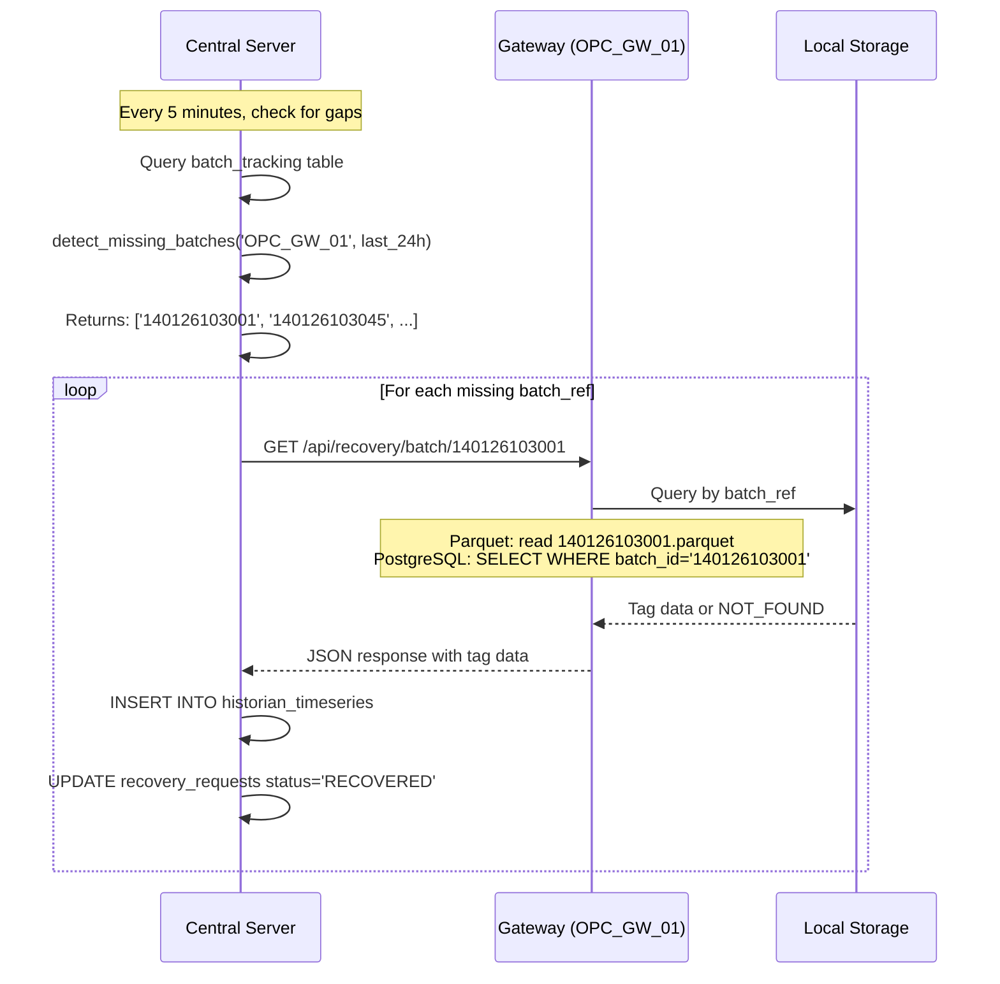

                    # OPC Gateway Architecture: Current vs Future

## Document Purpose
This document describes the **COMPLETE architecture** for OPC data acquisition, comparing:
- **CURRENT STATE**: Direct database writes from gateway
- **FUTURE STATE**: Decoupled MQTT architecture with smart gateway

---

## Table of Contents
1. [Current Architecture Overview](#1-current-architecture-overview)
2. [Current Architecture Flow Diagram](#2-current-architecture-flow-diagram)
3. [Current Module Details](#3-current-module-details)
4. [Future Architecture Overview](#4-future-architecture-overview)
5. [Smart Batch Polling Engine](#5-smart-batch-polling-engine-critical-design)
   - [5.4 Rate Control Responsibility](#54-rate-control-responsibility-gateway-vs-central)
6. [Future Data Flow Diagram](#6-future-data-flow-diagram)
7. [Future Module Details](#7-future-module-details)
8. [Change Matrix: Retain / Remove / Add](#8-change-matrix-retain--remove--add)
9. [Database Schema Changes](#9-database-schema-changes)
10. [Summary](#10-summary)
    - [10.3 Operational Notes](#103-operational-notes)

---

## 1. Current Architecture Overview

### 1.1 High-Level Summary

```
┌─────────────────────────────────────────────────────────────────────────────┐
│                     CURRENT OPC ARCHITECTURE (MONOLITHIC)                   │
├─────────────────────────────────────────────────────────────────────────────┤
│                                                                              │
│  ┌─────────────┐     ┌─────────────┐     ┌─────────────┐                    │
│  │ OPC DA      │────▶│ Tag Values  │────▶│ SignalR Hub │───▶ Web UI        │
│  │ Server      │     │ Pool        │     │ (OpcDaHub)  │    (Real-time)    │
│  │ (Matrikon)  │     │ Service     │     └─────────────┘                    │
│  └─────────────┘     └──────┬──────┘                                        │
│                             │                                                │
│                             ▼                                                │
│                      ┌─────────────┐     ┌─────────────┐                    │
│                      │ Data        │────▶│ Parquet     │───▶ D:\OpcLogs    │
│                      │ Logging     │     │ Files       │    (Analytics)    │
│                      │ Service     │     └─────────────┘                    │
│                      └──────┬──────┘                                        │
│                             │                                                │
│                             ▼                                                │
│                      ┌─────────────┐     ┌─────────────┐                    │
│                      │ Historian   │────▶│ PostgreSQL  │───▶ TimescaleDB   │
│                      │ Ingest      │     │ (Direct)    │    (Historian)    │
│                      │ Service     │     └─────────────┘                    │
│                      └─────────────┘                                        │
│                                                                              │
│  ⚠️ PROBLEM: Gateway has DIRECT database connection                        │
│  ⚠️ PROBLEM: No offline capability - DB down = data loss                   │
│  ⚠️ PROBLEM: No alarm evaluation at edge                                   │
│                                                                              │
└─────────────────────────────────────────────────────────────────────────────┘
```

### 1.2 Key Characteristics

| Aspect | Current State |
|--------|--------------|
| **Coupling** | Tight - Gateway writes directly to DB |
| **Offline Support** | ❌ None - DB connection required |
| **Alarm Evaluation** | ❌ None - Raw values only |
| **Guaranteed Delivery** | ❌ No - Network failure = data loss |
| **Transport** | Direct PostgreSQL connection |
| **Scalability** | Limited - Single DB connection |
| **Configuration** | Database polling (30s fallback) |

---

## 2. Current Architecture Flow Diagram

### 2.1 Data Acquisition Flow

```
┌───────────────────────────────────────────────────────────────────────────────────┐
│                           CURRENT OPC DATA FLOW                                    │
└───────────────────────────────────────────────────────────────────────────────────┘

   ┌─────────────┐
   │ OPC DA      │  Matrikon.OPC.Simulation.1 (or Kepware, etc.)
   │ Server      │  COM/DCOM Protocol
   └──────┬──────┘
          │
          │ 1. Timer polls every 1000ms (OpcPollingIntervalMs)
          ▼
   ┌─────────────────────────────────────────────────────────────────────────┐
   │                    OpcServerConnection.cs                                │
   │  • ReadTagValues() - Reads all monitored tags                           │
   │  • Caches values in memory dictionary                                    │
   │  • Raises TagValuesUpdated event                                        │
   └──────┬──────────────────────────────────────────────────────────────────┘
          │
          │ 2. TagValuesUpdated event fires
          │
          ├────────────────────────────────────────────────────────────────────┐
          │                                                                    │
          ▼                                                                    ▼
   ┌─────────────────────────────────┐                    ┌─────────────────────────────┐
   │    DataLoggingService.cs        │                    │    OpcDaHub.cs              │
   │  (BackgroundService)            │                    │  (SignalR Hub)              │
   │                                 │                    │                             │
   │  • Loop every 1000ms            │                    │  • async OnTagValuesUpdated │
   │  • Calls connection.GetCache()  │                    │  • Broadcasts to clients    │
   │  • Updates TagValuesPoolService │                    │  • Throttled broadcasts     │
   └──────┬──────────────────────────┘                    └─────────────────────────────┘
          │                                                            │
          │ 3. Updates shared cache                                    │ 4. Real-time UI
          ▼                                                            ▼
   ┌─────────────────────────────────┐                    ┌─────────────────────────────┐
   │    TagValuesPoolService.cs      │                    │    Web Browser (HMI)        │
   │  (Singleton - Thread-safe)      │                    │  • SignalR subscription     │
   │                                 │                    │  • Or REST polling          │
   │  • ConcurrentDictionary cache   │                    │  • GET /api/opc/values      │
   │  • UpdatePool(values, time)     │                    └─────────────────────────────┘
   │  • GetAllTagValues()            │
   │  • GetTagValues(tagIds)         │
   └──────┬──────────────────────────┘
          │
          │ 5. Multiple consumers read from pool
          │
          ├─────────────────────────────┬─────────────────────────────┐
          │                             │                             │
          ▼                             ▼                             ▼
   ┌──────────────────┐    ┌──────────────────────┐    ┌──────────────────────────┐
   │ Parquet Writer   │    │ HistorianIngest      │    │ OpcController.cs         │
   │ (DataLogging)    │    │ HostedService        │    │ (REST API)               │
   │                  │    │                      │    │                          │
   │ • Every 5000ms   │    │ • Reads mapped tags  │    │ • GET /api/opc/values    │
   │ • SelectedTags   │    │ • Rate control       │    │ • Returns all cache      │
   │ • 10MB rotation  │    │ • Deadband check     │    │ • For HMI polling        │
   └────────┬─────────┘    │ • DIRECT DB write    │    └──────────────────────────┘
            │              └──────────┬───────────┘
            │                         │
            ▼                         │ 6. DIRECT database write (⚠️ PROBLEM)
   ┌──────────────────┐               ▼
   │ D:\OpcLogs\Data\ │    ┌──────────────────────────────────────────────────┐
   │ *.parquet files  │    │         PostgreSQL / TimescaleDB                  │
   │                  │    │                                                   │
   │ • For analytics  │    │  historian_raw.historian_timeseries              │
   │ • Python imports │    │  • time, tag_id, value_num, quality              │
   └──────────────────┘    │  • DIRECT INSERT (no offline buffer)             │
                           │  • ⚠️ DB down = DATA LOSS                        │
                           └──────────────────────────────────────────────────┘
```

### 2.2 Configuration Flow

```
┌───────────────────────────────────────────────────────────────────────────────────┐
│                        CURRENT CONFIGURATION FLOW                                  │
└───────────────────────────────────────────────────────────────────────────────────┘

   ┌─────────────────────────────────────────────────────────────────────────┐
   │                    PostgreSQL Database                                   │
   │                                                                          │
   │  historian_meta.tag_master                                              │
   │  ┌────────────────────────────────────────────────────────────────────┐ │
   │  │ tag_id | tag_name | data_type | deadband_value | enabled | ...    │ │
   │  │ ───────┼──────────┼───────────┼────────────────┼─────────┼─────── │ │
   │  │ Tag001 | Temp     | Double    | 0.5            | true    | ...    │ │
   │  └────────────────────────────────────────────────────────────────────┘ │
   │                                                                          │
   │  NOTIFY 'mapping_updated' trigger on INSERT/UPDATE/DELETE               │
   └──────────────────────────────────────────────────────────────────────────┘
                                    │
                                    │ pg_notify() + polling fallback (30s)
                                    ▼
   ┌─────────────────────────────────────────────────────────────────────────┐
   │                    MappingCacheService.cs                               │
   │                                                                          │
   │  • Listens to PostgreSQL NOTIFY channel                                 │
   │  • Fallback polling every 30 seconds                                    │
   │  • ConcurrentDictionary<string, TagMapping> _cache                     │
   │  • GetMapping(tagId) → used by RateController                          │
   │  • GetAllEnabledMappings() → list of tags to poll                      │
   └─────────────────────────────────────────────────────────────────────────┘
                                    │
                                    │ Read by HistorianIngestHostedService
                                    ▼
   ┌─────────────────────────────────────────────────────────────────────────┐
   │                    RateControllerService.cs                             │
   │                                                                          │
   │  • Per-tag deadband check: |current - last| > deadband_value           │
   │  • Per-tag interval check: timeSinceLastWrite >= intervalMs            │
   │  • Returns WRITE or FILTER decision                                     │
   │  • ⚠️ Deadband used for DB writes, NOT for alarm evaluation            │
   └─────────────────────────────────────────────────────────────────────────┘
```

---

## 3. Current Module Details

### 3.1 Services (What Exists Now)

| Module | File | Purpose | Status |
|--------|------|---------|--------|
| **OpcDaService** | `Services/OpcDaService.cs` | Multi-server OPC connection manager | ✅ RETAIN |
| **OpcServerConnection** | `Services/OpcServerConnection.cs` | Single OPC server connection + polling | ✅ RETAIN |
| **TagValuesPoolService** | `Services/TagValuesPoolService.cs` | Shared tag values cache (thread-safe) | ✅ RETAIN |
| **DataLoggingService** | `Services/DataLoggingService.cs` | OPC polling loop + Parquet writer | ⚠️ MODIFY |
| **MappingCacheService** | `Services/HistorianIngest/Services/MappingCacheService.cs` | Tag config cache from DB | ✅ RETAIN |
| **RateControllerService** | `Services/HistorianIngest/Services/RateControllerService.cs` | Deadband + interval rate control | ✅ RETAIN |
| **BatcherService** | `Services/HistorianIngest/Services/BatcherService.cs` | Batch samples for DB write | ⚠️ MOVE to Central |
| **DbWriterService** | `Services/HistorianIngest/Services/DbWriterService.cs` | PostgreSQL batch insert | ⚠️ MOVE to Central |
| **HistorianIngestHostedService** | `Services/HistorianIngest/Services/HistorianIngestHostedService.cs` | Main historian ingest loop | ❌ REMOVE |
| **SpoolManagerService** | `Services/HistorianIngest/Services/SpoolManagerService.cs` | File spool for replay | ⚠️ REPURPOSE |
| **OpcDaHub** | `Hubs/OpcDaHub.cs` | SignalR real-time broadcast | ✅ RETAIN |
| **OpcController** | `Controllers/OpcController.cs` | REST API for tag values | ✅ RETAIN |

### 3.2 Module Function Details

#### OpcDaService.cs
```
PURPOSE: Manages multiple OPC DA server connections
FUNCTIONS:
  • DiscoverServers() → List<string> - Find local OPC servers
  • DiscoverRemoteServers(host) → List<RemoteServerInfo> - Find remote OPC servers
  • Connect(serverProgId, host) → bool - Establish connection
  • Disconnect(connectionId) → void - Close connection
  • GetActiveConnection() → OpcServerConnection - Get primary connection
  • GetAllConnections() → List<ServerConnectionInfo> - List all connections

EVENTS:
  • TagValuesUpdated → Fired when any connection reads new values
  
DEPENDENCIES:
  • OpcServerConnection (creates instances)
  • LoggingConfigService (for OPC polling interval)
  • IHealthStatusService (for health reporting)
```

#### OpcServerConnection.cs
```
PURPOSE: Single OPC DA server connection with polling
FUNCTIONS:
  • Connect() → bool - COM connection to OPC server
  • Disconnect() → void - Release COM objects
  • StartPolling(tags) → void - Begin timer-based polling
  • StopPolling() → void - Stop polling
  • ReadTagValues() → List<TagValue> - Read current values
  • GetCachedValues() → Dictionary<string, TagValue> - Get last read values

POLLING:
  • Timer fires every OpcPollingIntervalMs (default 1000ms)
  • Reads all monitored tags via IOPCItemMgt
  • Caches results in memory
  • Raises TagValuesUpdated event

COM INTEROP:
  • Uses OpcRcw.Da library for OPC DA 2.0/3.0
  • IOPCSyncIO for synchronous reads
  • IOPCBrowse for tag browsing
```

#### TagValuesPoolService.cs
```
PURPOSE: Thread-safe shared cache for all consumers
FUNCTIONS:
  • UpdatePool(values, timestamp) → void - Update cache from OPC
  • GetAllTagValues() → List<TagValueCacheEntry> - All cached values
  • GetTagValues(tagIds) → List<TagValueCacheEntry> - Filtered by tag list
  • GetLastUpdateTimestamp() → DateTime - Last update time
  • GetCachedTagCount() → int - Number of tags in cache
  • ClearPool() → void - Reset cache

THREAD SAFETY:
  • ConcurrentDictionary<string, TagValueCacheEntry>
  • Lock-free reads (high performance)
  • Single writer (DataLoggingService)

CONSUMERS:
  1. OpcController (REST API)
  2. OpcDaHub (SignalR broadcast)
  3. HistorianIngestHostedService (DB writes)
  4. Parquet writer (file logging)
```

#### DataLoggingService.cs
```
PURPOSE: Main OPC polling loop + Configurable local logging
FUNCTIONS:
  • ExecuteAsync() - BackgroundService main loop
  • CreateOpcConnection() - Establish dedicated OPC connection
  • PollOpcData() - Read values and update pool
  • WriteLocalStorage() - Route to Parquet OR PostgreSQL based on config

LOOP (every OpcPollingIntervalMs = 1000ms):
  1. Read from OPC connection
  2. Update TagValuesPoolService (ALWAYS)
  3. Generate batch reference (filename OR batch_id)
  4. IF LocalLoggingMode == "Parquet":
     • Write parquet file (SelectedTags from config)
  5. ELSE IF LocalLoggingMode == "PostgreSQL":
     • Insert to Local PostgreSQL (ALL enabled tags)
  6. Publish MQTT message with batch reference

CONFIGURATION-DRIVEN OUTPUT:
  • Mode A: D:\OpcLogs\Data\*.parquet (10MB rotation, 30 days)
  • Mode B: edge_historian.buffer_data (7-day retention)
  • Config: logging-config.json → "LocalLoggingMode": "Parquet"|"PostgreSQL"
```

#### HistorianIngestHostedService.cs (⚠️ TO BE REMOVED)
```
PURPOSE: Direct database writes from gateway
FUNCTIONS:
  • ExecuteAsync() - Main historian loop
  • ProcessPoolDataAsync() - Read from TagValuesPool, write to DB
  • StartHistorianOpcPollingAsync() - Precise polling loop

CURRENT FLOW:
  1. Read mapped tags from TagValuesPoolService
  2. Apply RateControllerService deadband/interval check
  3. Batch samples via BatcherService
  4. Write directly to PostgreSQL via DbWriterService
  
⚠️ PROBLEMS:
  • Direct DB connection from gateway
  • No offline buffering
  • No guaranteed delivery
  • No alarm evaluation
  
🔄 FUTURE: REMOVE - replaced by MQTT publish + Central ingest
```

---

## 4. Future Architecture Overview

### 4.1 High-Level Summary

```
┌────────────────────────────────────────────────────────────────────────────────┐
│                         OPC DA SERVER (PLC/DCS)                                │
│                    (Real-time process data source)                             │
└───────────────────────────────┬────────────────────────────────────────────────┘
                                │
                                │ OPC DA COM/DCOM Protocol
                                ▼
┌────────────────────────────────────────────────────────────────────────────────┐
│                            EDGE GATEWAY                                         │
│                                                                                 │
│  ┌──────────────────────────────────────────────────────────────────────────┐  │
│  │              SMART BATCH POLLING ENGINE (Database-Driven)                 │  │
│  │                                                                           │  │
│  │  • Tag poll intervals from historian_meta.tag_master                     │  │
│  │  • Single OPC read per cycle (ALL tags together) - NO PLC STRESS        │  │
│  │  • Gateway-side filtering: which tags to include in MQTT/Parquet        │  │
│  │  • Base cycle: 200ms (reads all tags, filters per-tag intervals)        │  │
│  └───────────────────────────────┬───────────────────────────────────────────┘  │
│                                  │                                              │
│                                  │ SAME DATA FEEDS TWO INDEPENDENT PATHS       │
│                                  │                                              │
│          ┌───────────────────────┴───────────────────────┐                     │
│          │                                               │                     │
│          ▼                                               ▼                     │
│  ┌───────────────────────────┐               ┌───────────────────────────┐     │
│  │   LOCAL LOGGING ENGINE    │               │    MQTT PUBLISHER         │     │
│  │   (CONFIGURABLE MODE)     │               │    (LIVE TRANSPORT)       │     │
│  │                           │               │                           │     │
│  │ ┌─────────────────────┐   │               │  • JSON messages          │     │
│  │ │ MODE A: PARQUET     │   │               │  • QoS 1 (best-effort)    │     │
│  │ │ • *.parquet files   │   │               │  • Topic: opc/{server}/   │     │
│  │ │ • D:\OpcLogs\Data\ │   │               │  • Batch publish          │     │
│  │ │ • 10MB rotation     │   │               │                           │     │
│  │ └─────────────────────┘   │               │                           │     │
│  │ ┌─────────────────────┐   │               │                           │     │
│  │ │ MODE B: POSTGRESQL  │   │               │                           │     │
│  │ │ • edge_historian DB │   │               │                           │     │
│  │ │ • batch_id tracking │   │               │                           │     │
│  │ │ • 30-day retention   │   │               │                           │     │
│  │ └─────────────────────┘   │               │                           │     │
│  └─────────────┬─────────────┘               └─────────────┬─────────────┘     │
│                │                                           │                   │
└────────────────┼───────────────────────────────────────────┼───────────────────┘
                 │                                           │
                 │                                           ▼
                 │                              ┌─────────────────────────┐
                 │                              │     MQTT BROKER         │
                 │                              │     (Mosquitto)         │
                 │                              │     Port: 1883          │
                 │                              └────────────┬────────────┘
                 │                                           │
                 │                                           ▼
                 │                              ┌─────────────────────────────────┐
                 │                              │       CENTRAL SERVER            │
                 │                              │                                 │
                 │                              │  ┌───────────────────────────┐  │
                 │                              │  │   MQTT SUBSCRIBER         │  │
                 │                              │  │   Subscribe: opc/+/tags   │  │
                 │                              │  └─────────────┬─────────────┘  │
                 │                              │                │                │
                 │                              │                ▼                │
                 │                              │  ┌───────────────────────────┐  │
                 │                              │  │   DB INGEST SERVICE       │  │
                 │                              │  │   • Rate control          │  │
                 │                              │  │   • Batch INSERT          │  │
                 │                              │  │   • Idempotent writes     │  │
                 │                              │  └─────────────┬─────────────┘  │
                 │                              │                │                │
                 │                              │                ▼                │
                 │                              │  ┌───────────────────────────┐  │
                 │                              │  │   PostgreSQL/TimescaleDB  │  │
                 │                              │  │   historian_timeseries    │  │
                 │                              │  │   (SINGLE SOURCE OF TRUTH)│  │
                 │                              │  └───────────────────────────┘  │
                 │                              └─────────────────────────────────┘
                 │
                 ▼
┌────────────────────────────────────────────────────────────────────────────────┐
│                   LOCAL LOGGING STORAGE (CONFIGURABLE)                          │
│                                                                                 │
│  ┌─────────────────────────────────────────────────────────────────────────┐   │
│  │                        CONFIGURATION DRIVEN                             │   │
│  │                                                                          │   │
│  │  logging-config.json: {"LocalLoggingMode": "Parquet" | "PostgreSQL"}   │   │
│  └─────────────────────────────────────────────────────────────────────────┘   │
│                                                                                 │
│  ┏━━━━━━━━━━━━━━━━━━━━━━━━━━━━━━━━━━━━━━━━━━━━━━━━━━━━━━━━━━━━━━━━━━━━━━━━━━━━━┓   │
│  ┃                        MODE A: PARQUET FILES                            ┃   │
│  ┗━━━━━━━━━━━━━━━━━━━━━━━━━━━━━━━━━━━━━━━━━━━━━━━━━━━━━━━━━━━━━━━━━━━━━━━━━━━━━┛   │
│  • Location: D:\OpcLogs\Data\{date}\{timestamp}.parquet                      │
│  • Cleanup: 30 days OR 10GB total size                                       │
│  • Schema: RowId, TagId, Timestamp, Value, Quality                             │
│  • Use Case: File-based analytics, Python processing                          │
│                                                                                 │
│  ┏━━━━━━━━━━━━━━━━━━━━━━━━━━━━━━━━━━━━━━━━━━━━━━━━━━━━━━━━━━━━━━━━━━━━━━━━━━━━━┓   │
│  ┃                      MODE B: POSTGRESQL DATABASE                        ┃   │
│  ┗━━━━━━━━━━━━━━━━━━━━━━━━━━━━━━━━━━━━━━━━━━━━━━━━━━━━━━━━━━━━━━━━━━━━━━━━━━━━━┛   │
│  • Database: edge_historian.buffer_data                                       │
│  • Cleanup: 7 days automatic retention                                        │
│  • Schema: batch_id (ddmmyyhhmmss), tag_id, timestamp, value, quality        │
│  • Use Case: Structured queries, batch_id tracking, SQL-based recovery       │
│                                                                                 │
│  PURPOSE (Both Modes):                                                         │
│  • Primary data buffer at edge gateway                                         │
│  • Source for MQTT message construction                                        │
│  • Offline resilience during network outages                                  │
│  • NOT the source of truth (Central DB is authoritative)                      │
└────────────────────────────────────────────────────────────────────────────────┘
```

### 4.2 Key Design Principles

| Principle | Implementation |
|-----------|----------------|
| **No PLC Stress** | Single OPC read per cycle, all enabled tags in one batch |
| **Database-Driven Config** | Poll intervals from `historian_meta.tag_master` |
| **Configurable Local Logging** | Choose Parquet OR PostgreSQL via `LocalLoggingMode` setting |
| **Central DB is Truth** | Local storage is buffer only, Central DB is authoritative |
| **Best-Effort Live Transport** | MQTT QoS 1 (no spool/retry - Local storage is durability layer) |
| **Offline Resilience** | Local storage continues if MQTT fails; recovery method varies by mode |

---

## 5. Smart Batch Polling Engine (Critical Design)

### 5.1 Why Batch Polling?

```
┌─────────────────────────────────────────────────────────────────────────────────┐
│                    ❌ WRONG: Per-Tag Individual Polling                         │
├─────────────────────────────────────────────────────────────────────────────────┤
│                                                                                 │
│  Tag A (100ms) ──────▶ OPC Read ──────▶ PLC                                    │
│  Tag B (200ms) ──────▶ OPC Read ──────▶ PLC   ← MULTIPLE REQUESTS             │
│  Tag C (500ms) ──────▶ OPC Read ──────▶ PLC   ← STRESS ON PLC!               │
│  Tag D (1000ms)──────▶ OPC Read ──────▶ PLC                                    │
│                                                                                 │
│  ⚠️ PROBLEM: 4 separate OPC reads = 4 PLC communication cycles                │
│  ⚠️ PROBLEM: PLC CPU overhead multiplied                                       │
│  ⚠️ PROBLEM: Network congestion with many tags                                │
│                                                                                 │
└─────────────────────────────────────────────────────────────────────────────────┘

┌─────────────────────────────────────────────────────────────────────────────────┐
│                    ✅ CORRECT: Single Batch Polling                             │
├─────────────────────────────────────────────────────────────────────────────────┤
│                                                                                 │
│  BASE CYCLE: 200ms (configurable)                                              │
│                                                                                 │
│  ┌─────────────────────────────────────────────────────────────────────────┐   │
│  │  SINGLE OPC READ (all tags in one request)                              │   │
│  │  Tag A, Tag B, Tag C, Tag D → ONE batch read → PLC                      │   │
│  └─────────────────────────────────────────────────────────────────────────┘   │
│                           │                                                     │
│                           ▼                                                     │
│  ┌─────────────────────────────────────────────────────────────────────────┐   │
│  │  GATEWAY-SIDE FILTERING (per-tag intervals)                             │   │
│  │                                                                          │   │
│  │  Cycle 1 (0ms):    Tag A ✓  Tag B ✓  Tag C ✓  Tag D ✓  → All           │   │
│  │  Cycle 2 (200ms):  Tag A ✓  Tag B ✓  Tag C ✗  Tag D ✗  → A, B          │   │
│  │  Cycle 3 (400ms):  Tag A ✓  Tag B ✓  Tag C ✗  Tag D ✗  → A, B          │   │
│  │  Cycle 4 (600ms):  Tag A ✓  Tag B ✓  Tag C ✓  Tag D ✗  → A, B, C       │   │
│  │  Cycle 5 (800ms):  Tag A ✓  Tag B ✓  Tag C ✗  Tag D ✗  → A, B          │   │
│  │  Cycle 6 (1000ms): Tag A ✓  Tag B ✓  Tag C ✓  Tag D ✓  → All           │   │
│  │                                                                          │   │
│  │  ✓ = Include in MQTT/Parquet this cycle                                 │   │
│  │  ✗ = Skip (not due yet based on tag's poll interval)                    │   │
│  └─────────────────────────────────────────────────────────────────────────┘   │
│                                                                                 │
│  ✅ BENEFIT: Only 1 PLC communication per cycle (no stress)                    │
│  ✅ BENEFIT: All tags read together (single OPC batch read)                    │
│  ✅ BENEFIT: Per-tag intervals honored at gateway filtering stage              │
│  ✅ BENEFIT: Database config drives behavior without code changes              │
│                                                                                 │
└─────────────────────────────────────────────────────────────────────────────────┘
```

> **⚠️ IMPORTANT: Enabled Tags Only**
>
> Only **enabled** tags (`enabled = true` in `historian_meta.tag_master`) are added to the OPC batch group.
> Disabled tags are **not** added to the OPC subscription and do not contribute to PLC load.
> This ensures that unused or decommissioned tags never appear in the batch read.

### 5.2 Database-Driven Tag Configuration

```sql
-- historian_meta.tag_master drives polling behavior
-- Gateway reads this table to determine:
--   1. Which tags to monitor
--   2. How often each tag should be included in MQTT/Parquet

SELECT 
    tag_id,
    tag_name,
    poll_interval_ms,       -- How often to INCLUDE in output (200, 500, 1000, etc.)
    deadband_value,         -- Change threshold for DB writes
    enabled                 -- Whether tag is active
FROM historian_meta.tag_master
WHERE enabled = true;

-- EXAMPLE TAG CONFIGURATION:
-- ┌──────────────────────┬──────────────────┬─────────────────┬──────────┐
-- │ tag_id               │ tag_name         │ poll_interval_ms│ deadband │
-- ├──────────────────────┼──────────────────┼─────────────────┼──────────┤
-- │ Random.Real4         │ Tank Temperature │ 1000            │ 0.5      │
-- │ Pump1.Speed          │ Pump 1 RPM       │ 200             │ 5.0      │
-- │ Valve1.Position      │ Valve 1 %        │ 500             │ 1.0      │
-- │ Compressor.Status    │ Compressor Run   │ 1000            │ 0        │
-- └──────────────────────┴──────────────────┴─────────────────┴──────────┘
```

### 5.3 Batch Polling Algorithm

```
ALGORITHM: SmartBatchPoll

INPUTS:
  - BASE_CYCLE_MS = 200  (minimum polling granularity)
  - tags[] from historian_meta.tag_master (with poll_interval_ms)
  
STATE:
  - lastIncludedTime[tag_id] → timestamp of last inclusion in output

EVERY BASE_CYCLE_MS:
  
  1. BATCH OPC READ (single request, all tags):
     ┌───────────────────────────────────────────────────────────────┐
     │  values = OpcConnection.ReadAllTags()  // ONE OPC call        │
     │  // Reads ALL monitored tags in single batch                  │
     │  // Minimal PLC stress regardless of tag count                │
     └───────────────────────────────────────────────────────────────┘
  
  2. UPDATE TAG CACHE (always):
     ┌───────────────────────────────────────────────────────────────┐
     │  TagValuesPoolService.UpdatePool(values, now)                 │
     │  // In-memory cache always has latest values                  │
     │  // Used by REST API, SignalR for real-time UI                │
     └───────────────────────────────────────────────────────────────┘
  
  3. FILTER FOR OUTPUT (per-tag intervals):
     ┌───────────────────────────────────────────────────────────────┐
     │  outputBatch = []                                             │
     │                                                               │
     │  FOR EACH tag in values:                                      │
     │    timeSinceLast = now - lastIncludedTime[tag.tag_id]        │
     │    tagConfig = MappingCache.GetConfig(tag.tag_id)            │
     │                                                               │
     │    IF timeSinceLast >= tagConfig.poll_interval_ms:           │
     │      outputBatch.Add(tag)                                     │
     │      lastIncludedTime[tag.tag_id] = now                      │
     │                                                               │
     │  // outputBatch contains only tags DUE for this cycle        │
     └───────────────────────────────────────────────────────────────┘
  
  4. LOCAL STORAGE + MQTT PUBLISH (unified batch reference):
     ┌───────────────────────────────────────────────────────────────┐
     │  // STEP A: Generate MQTT batch reference (every second)         │
     │  mqtt_batch_ref = GenerateBatchRef() // Format: ddmmyyhhmmss     │
     │  // Example: "140126103001" (14 Jan 2026, 10:30:01)            │
     │                                                               │
     │  // STEP B: Store Locally (mode-dependent storage)             │
     │  IF LocalLoggingMode == "Parquet":                           │
     │    current_parquet_file = GetCurrentParquetFile() // e.g. "140126_103000_005.parquet" │
     │    ParquetLogger.AppendToFile(outputBatch, current_parquet_file)│
     │    // Multiple MQTT batches stored in same parquet file        │
     │  ELSE IF LocalLoggingMode == "PostgreSQL":                   │
     │    LocalDB.Insert(outputBatch, batch_id=mqtt_batch_ref)       │
     │                                                               │
     │  // STEP C: Publish via MQTT (every second)                    │
     │  mqtt_payload = {                                              │
     │    batch_ref: mqtt_batch_ref,      // "140126103001"          │
     │    parquet_file: current_parquet_file, // "140126_103000_005.parquet" │
     │    gateway_id, tags: outputBatch                              │
     │  }                                                            │
     │  MqttPublisher.Publish(mqtt_payload)                          │
     └───────────────────────────────────────────────────────────────┘

END EVERY
```

### 5.4 Rate Control Responsibility (Gateway vs Central)

```
┌─────────────────────────────────────────────────────────────────────────────────┐
│                    RATE CONTROL SPLIT                                           │
├─────────────────────────────────────────────────────────────────────────────────┤
│                                                                                 │
│  ┌─────────────────────────────────────────────────────────────────────────┐   │
│  │  GATEWAY (poll_interval_ms)                                             │   │
│  │  ────────────────────────────                                           │   │
│  │  Controls: WHEN data is sent (output frequency)                         │   │
│  │  Purpose:  Reduce MQTT/Parquet volume for slow-changing tags            │   │
│  │  Example:  Tag with poll_interval_ms=1000 → sent once per second        │   │
│  └─────────────────────────────────────────────────────────────────────────┘   │
│                                                                                 │
│                              │                                                  │
│                              ▼                                                  │
│                                                                                 │
│  ┌─────────────────────────────────────────────────────────────────────────┐   │
│  │  CENTRAL (deadband_value via RateControllerService)                     │   │
│  │  ──────────────────────────────────────────────────                     │   │
│  │  Controls: WHETHER data is stored (change detection)                    │   │
│  │  Purpose:  Reduce DB writes for values that haven't meaningfully changed│   │
│  │  Example:  Tag with deadband=0.5 → only write if |new - old| > 0.5     │   │
│  └─────────────────────────────────────────────────────────────────────────┘   │
│                                                                                 │
│  ⚠️ KEY RULE: These are COMPLEMENTARY, not redundant.                         │
│     Gateway filters by TIME, Central filters by VALUE.                         │
│                                                                                 │
└─────────────────────────────────────────────────────────────────────────────────┘
```

---

## 6. Future Data Flow Diagram

### 6.1 Complete Data Acquisition Flow

```
┌───────────────────────────────────────────────────────────────────────────────────┐
│                           FUTURE OPC DATA FLOW                                     │
└───────────────────────────────────────────────────────────────────────────────────┘

   ┌─────────────────────────────────────────────────────────────────────────┐
   │                    OPC DA SERVER (PLC/DCS)                              │
   │  • Matrikon.OPC.Simulation.1, Kepware, RSLinx, etc.                    │
   │  • COM/DCOM Protocol                                                    │
   └──────────────────────────────────┬──────────────────────────────────────┘
                                      │
                                      │ SINGLE batch read per cycle
                                      ▼
   ┌─────────────────────────────────────────────────────────────────────────┐
   │                    SMART BATCH POLLING ENGINE                           │
   │                                                                          │
   │  ┌────────────────────────────────────────────────────────────────────┐ │
   │  │ 1. OPC BATCH READ (every BASE_CYCLE_MS = 200ms)                    │ │
   │  │    • Single OPC call reads ALL monitored tags                      │ │
   │  │    • No individual per-tag polling (no PLC stress)                 │ │
   │  │    • Result: Dictionary<tagId, value>                              │ │
   │  └────────────────────────────────────────────────────────────────────┘ │
   │                              │                                          │
   │                              ▼                                          │
   │  ┌────────────────────────────────────────────────────────────────────┐ │
   │  │ 2. UPDATE IN-MEMORY CACHE (always)                                 │ │
   │  │    TagValuesPoolService.UpdatePool(allValues, timestamp)          │ │
   │  │    • REST API sees latest values immediately                       │ │
   │  │    • SignalR broadcasts latest values                              │ │
   │  └────────────────────────────────────────────────────────────────────┘ │
   │                              │                                          │
   │                              ▼                                          │
   │  ┌────────────────────────────────────────────────────────────────────┐ │
   │  │ 3. FILTER BY PER-TAG INTERVAL (gateway-side)                       │ │
   │  │                                                                     │ │
   │  │    FOR EACH tag:                                                   │ │
   │  │      config = MappingCache.GetConfig(tag_id)                       │ │
   │  │      IF (now - lastOutput[tag]) >= config.poll_interval_ms:        │ │
   │  │        outputBatch.Add(tag)                                        │ │
   │  │        lastOutput[tag] = now                                       │ │
   │  │                                                                     │ │
   │  │    EXAMPLE (BASE_CYCLE = 200ms):                                   │ │
   │  │    ┌─────────────┬─────────────────┬────────────────────────────┐  │ │
   │  │    │ Tag         │ poll_interval_ms│ Output Cycles              │  │ │
   │  │    ├─────────────┼─────────────────┼────────────────────────────┤  │ │
   │  │    │ FastTag     │ 200             │ 0, 200, 400, 600, 800...  │  │ │
   │  │    │ MediumTag   │ 500             │ 0, 500, 1000, 1500...     │  │ │
   │  │    │ SlowTag     │ 1000            │ 0, 1000, 2000, 3000...    │  │ │
   │  │    └─────────────┴─────────────────┴────────────────────────────┘  │ │
   │  └────────────────────────────────────────────────────────────────────┘ │
   │                              │                                          │
   │                              │ outputBatch (filtered tags due this cycle)
   │                              │                                          │
   │          ┌───────────────────┴───────────────────┐                     │
   │          │                                       │                     │
   │          ▼                                       ▼                     │
   │  ┌────────────────────────┐           ┌────────────────────────┐       │
   │  │ STEP A: LOCAL DB STORE │           │ STEP B: MQTT PUBLISHER │       │
   │  │ (PRIMARY BUFFER)       │           │ (BEST-EFFORT LIVE)     │       │
   │  │                        │           │                        │       │
   │  │ • Insert every cycle   │           │ • Publish every cycle  │       │
   │  │ • Table: buffer_data   │           │ • Topic: opc/{server}/ │       │
   │  │ • Batch ID tracking    │           │ • QoS 1 (no spool)     │       │
   │  │ • 7-day retention      │           │ • JSON format          │       │
   │  │                        │           │                        │       │
   │  │ ★ PRIMARY durability   │           │ Sequential after DB    │
   │  │ ★ Source of MQTT data  │           │ Uses same batch_id     │
   │  └────────────┬───────────┘           └────────────┬───────────┘       │
   │               │                                    │                   │
   └───────────────┼────────────────────────────────────┼───────────────────┘
                   │                                    │
                   │                                    ▼
                   │                       ┌─────────────────────────┐
                   │                       │     MQTT BROKER         │
                   │                       │     (Mosquitto)         │
                   │                       │     localhost:1883      │
                   │                       └────────────┬────────────┘
                   │                                    │
                   │                                    │ Subscribe: opc/+/tags
                   │                                    ▼
                   │                       ╔═════════════════════════════════╗
                   │                       ║      CENTRAL SERVER             ║
                   │                       ╠═════════════════════════════════╣
                   │                       ║                                 ║
                   │                       ║  ┌───────────────────────────┐  ║
                   │                       ║  │  MQTT SUBSCRIBER          │  ║
                   │                       ║  │  • Parse JSON messages    │  ║
                   │                       ║  │  • Route to DB ingest     │  ║
                   │                       ║  └─────────────┬─────────────┘  ║
                   │                       ║                │                ║
                   │                       ║                ▼                ║
                   │                       ║  ┌───────────────────────────┐  ║
                   │                       ║  │  DB INGEST SERVICE        │  ║
                   │                       ║  │  • Rate control (deadband)│  ║
                   │                       ║  │  • Batch INSERT           │  ║
                   │                       ║  │  • Idempotent writes      │  ║
                   │                       ║  └─────────────┬─────────────┘  ║
                   │                       ║                │                ║
                   │                       ║                ▼                ║
                   │                       ║  ┌───────────────────────────┐  ║
                   │                       ║  │  PostgreSQL/TimescaleDB   │  ║
                   │                       ║  │  historian_timeseries     │  ║
                   │                       ║  │                           │  ║
                   │                       ║  │  ★ SINGLE SOURCE OF TRUTH │  ║
                   │                       ║  │  ★ All queries go here    │  ║
                   │                       ║  └───────────────────────────┘  ║
                   │                       ║                                 ║
                   │                       ╚═════════════════════════════════╝
                   │
                   ▼
   ┌─────────────────────────────────────────────────────────────────────────┐
   │                 LOCAL STORAGE (CONFIGURABLE MODE)                      │
   │                                                                          │
   │  Configuration: logging-config.json                                     │
   │  { "LocalLoggingMode": "Parquet" }  OR  { "LocalLoggingMode": "PostgreSQL" }│
   │                                                                          │
   │  ┌──────────────────────────────────────────────────────────────────┐   │
   │  │                    MODE A: PARQUET FILES                         │   │
   │  │                                                                   │   │
   │  │  Location: D:\OpcLogs\Data\{date}\                               │   │
   │  │  Naming:   {ddmmyy}_{hhmmss}_{sequence}.parquet                 │   │
   │  │  Example:  140126_103000_001.parquet (contains multiple MQTT batches) │   │
   │  │  Content:  Each file contains 100+ MQTT batch_refs              │   │
   │  │  Cleanup:  30 days OR 10GB total size                            │   │
   │  │  Recovery: MQTT contains parquet_file reference for lookup      │   │
   │  └──────────────────────────────────────────────────────────────────┘   │
   │                                                                          │
   │  ┌──────────────────────────────────────────────────────────────────┐   │
   │  │                  MODE B: POSTGRESQL DATABASE                     │   │
   │  │                                                                   │   │
   │  │  Database: edge_historian.buffer_data                            │   │
   │  │  batch_id: {ddmmyyhhmmss} (VARCHAR(12))                         │   │
   │  │  Example:  140126103001, 140126103002, 140126103003              │   │
   │  │  Cleanup:  DELETE WHERE timestamp < NOW() - INTERVAL '7 days'    │   │
   │  │  Recovery: Query Central for missing batch_refs, SELECT from DB  │   │
   │  └──────────────────────────────────────────────────────────────────┘   │
   │                                                                          │
   │  SHARED PURPOSE (Both Modes):                                           │
   │  • Primary data buffer at edge gateway                                   │
   │  • Source for MQTT message construction                                  │
   │  • Offline resilience during network outages                            │
   │  • NOT the source of truth (Central DB is authoritative)                │
   └─────────────────────────────────────────────────────────────────────────┘
```

### 6.2 MQTT Message Format

```json
// PostgreSQL Mode - batch_ref maps directly to database record
{
  "gateway_id": "OPC_GW_01",
  "server_id": "Direct_PLC_Connection",
  "timestamp": "2026-01-14T10:30:01.123Z",
  "batch_ref": "140126103001",
  "local_logging_mode": "PostgreSQL",
  "tag_count": 25,
  "tags": [
    {
      "tag_id": "Random.Real4",
      "value": 85.5,
      "data_type": "Double",
      "quality": "Good",
      "opc_timestamp": "2026-01-14T10:30:01.100Z"
    }
  ]
}

// Parquet Mode - includes parquet_file reference for recovery
{
  "gateway_id": "OPC_GW_01",
  "server_id": "Direct_PLC_Connection", 
  "timestamp": "2026-01-14T10:30:01.123Z",
  "batch_ref": "140126103001",           // MQTT batch identifier
  "parquet_file": "140126_103000_001.parquet", // Which file contains this data
  "local_logging_mode": "Parquet",
  "tag_count": 25,
  "tags": [...]
}
```

### 6.3 Offline Recovery Scenario

```
┌───────────────────────────────────────────────────────────────────────────────────┐
│                    SCENARIO: Network/MQTT Failure                                 │
└───────────────────────────────────────────────────────────────────────────────────┘

   NORMAL OPERATION:
   ─────────────────
   Gateway ──MQTT──▶ Broker ──▶ Central ──▶ PostgreSQL ✓
       │
       └─Parquet──▶ D:\OpcLogs\ ✓ (backup)

   FAILURE (Network down at 10:00):
   ─────────────────────────────────
   Gateway ──MQTT──▶ ✗ FAILED (network down)
       │
       │  ┌─────────────────────────────────────────────────────────┐
       │  │ MQTT Publisher (best-effort):                           │
       │  │ • Detect send failure → log warning                     │
       │  │ • NO local spool or retry logic                         │
       │  │ • Messages during outage are NOT automatically replayed │
       │  │ • Local PostgreSQL DB is the ONLY durability mechanism │
       │  └─────────────────────────────────────────────────────────┘
       │
       └─Local DB──▶ PostgreSQL (edge_historian) ✓ (CONTINUES!)
                    │
                    │ Database rows accumulate:
                    │ ├── batch_id: 140126100001, 140126100002...
                    │ ├── All tag data stored locally
                    │ ├── Retention policy still active
                    │ └── ... (continues every second)

   RECOVERY (Network restored at 12:00):
   ─────────────────────────────────────
   Gateway ──MQTT──▶ Broker ──▶ Central ✓ (reconnected - new data flows)
       │
       │  ┌─────────────────────────────────────────────────────────┐
       │  │ DATA GAP (10:00 - 12:00):                               │
       │  │ • Central DB is MISSING data from outage period         │
       │  │ • Local PostgreSQL DB has complete data                 │
       │  │ • MANUAL recovery: Query local DB by batch_id range     │
       │  │ • Tool: SELECT * WHERE batch_id BETWEEN '140126100001'  │
       │  │   AND '140126120000' → export → import to Central       │
       │  └─────────────────────────────────────────────────────────┘
       │
       └─Local DB──▶ Complete data from 10:00-12:00 ✓

   RESULT:
   ─────────
   • Central DB: Missing 2-hour gap (until manual import)
   • Local DB: Has complete data with batch_id tracking
   • Recovery: SQL queries by batch_id range for precise recovery
   • Trade-off: Simplicity over automatic backfill complexity
```

> **⚠️ DESIGN DECISION: No Automatic Backfill**
>
> We intentionally chose **NOT** to implement automatic MQTT retry/spool because:
> 1. It adds complexity that contradicts the "Local DB as buffer" philosophy
> 2. Spool + retry creates ordering and idempotency edge cases
> 3. Local PostgreSQL DB already captures all data reliably with batch_id tracking
> 4. Manual import is rarely needed (network outages are infrequent)
>
> **If automatic backfill is needed later**, it should be a separate offline tool that:
> - Queries local DB by batch_id range during outage period
> - Compares with Central DB to find gaps
> - Reconstructs and publishes missing MQTT messages

---

## 7. Future Module Details

### 7.1 Gateway Services (Modified/New)

| Module | File | Purpose | Status |
|--------|------|---------|--------|
| **OpcDaService** | `Services/OpcDaService.cs` | OPC connection manager | ✅ RETAIN |
| **OpcServerConnection** | `Services/OpcServerConnection.cs` | OPC batch polling | ⚠️ MODIFY (batch read) |
| **TagValuesPoolService** | `Services/TagValuesPoolService.cs` | In-memory cache | ✅ RETAIN |
| **DataLoggingService** | `Services/DataLoggingService.cs` | Local DB logger | ⚠️ MODIFY (use Local PostgreSQL) |
| **MappingCacheService** | `Services/HistorianIngest/Services/MappingCacheService.cs` | Tag config cache | ✅ RETAIN |
| **SmartBatchPollingService** | `Services/SmartBatchPollingService.cs` | Batch poll + filter + DB store | 🆕 NEW |
| **OpcMqttPublisherService** | `Services/Mqtt/OpcMqttPublisherService.cs` | MQTT publish (reads from Local DB) | 🆕 NEW |
| **LocalDbCleanupService** | `Services/LocalDbCleanupService.cs` | 7-day retention cleanup | 🆕 NEW |
| **OpcDaHub** | `Hubs/OpcDaHub.cs` | SignalR broadcast | ✅ RETAIN |
| **OpcController** | `Controllers/OpcController.cs` | REST API | ✅ RETAIN |

### 7.2 Central Server Services (New)

| Module | File | Purpose |
|--------|------|---------|
| **MqttSubscriberService** | `Services/CentralIngest/MqttSubscriberService.cs` | Subscribe opc/+/tags, plc/+/tags |
| **DbIngestService** | `Services/CentralIngest/DbIngestService.cs` | Rate control + batch INSERT |
| **LiveDataCacheService** | `Services/CentralIngest/LiveDataCacheService.cs` | In-memory cache for HMI |
| **BatchRecoveryService** | `Services/CentralIngest/BatchRecoveryService.cs` | **Missing batch detection + recovery** |
| **GatewayRecoveryClient** | `Services/CentralIngest/GatewayRecoveryClient.cs` | **Fetch missing data from gateways** |

### 7.3 Services to REMOVE

| Module | File | Reason |
|--------|------|--------|
| **HistorianIngestHostedService** | `Services/HistorianIngest/Services/HistorianIngestHostedService.cs` | Replaced by MQTT flow |
| **DbWriterService** | `Services/HistorianIngest/Services/DbWriterService.cs` | Moved to Central |
| **BatcherService** | `Services/HistorianIngest/Services/BatcherService.cs` | Moved to Central |

---

## 8. Change Matrix: Retain / Remove / Add

### 8.1 Gateway Components

| Component | Decision | Reason |
|-----------|----------|--------|
| OpcDaService | ✅ **RETAIN** | Core OPC connection manager |
| OpcServerConnection | ⚠️ **MODIFY** | Change to single batch read per cycle |
| TagValuesPoolService | ✅ **RETAIN** | Shared cache - unchanged |
| DataLoggingService | ⚠️ **MODIFY** | Use filtered batch for parquet |
| MappingCacheService | ✅ **RETAIN** | Still reads tag config from DB |
| RateControllerService | 🔄 **MOVE** | Move to Central Server |
| BatcherService | 🔄 **MOVE** | Move to Central Server |
| DbWriterService | 🔄 **MOVE** | Move to Central Server |
| HistorianIngestHostedService | ❌ **REMOVE** | Replaced by MQTT flow |
| OpcDaHub | ✅ **RETAIN** | SignalR still used for UI |
| OpcController | ✅ **RETAIN** | REST API still used |

### 8.2 New Gateway Components

| Component | File Path | Purpose |
|-----------|-----------|--------|
| SmartBatchPollingService | Services/SmartBatchPollingService.cs | Single OPC read + per-tag filtering + Local DB storage |
| OpcMqttPublisherService | Services/Mqtt/OpcMqttPublisherService.cs | MQTT publish (best-effort, reads from Local DB) |
| LocalDbCleanupService | Services/LocalDbCleanupService.cs | 7-day retention policy for edge_historian.buffer_data |
| EdgeHistorianDbService | Services/EdgeHistorianDbService.cs | PostgreSQL connection manager for local buffer DB |

### 8.3 New Central Server Components

| Component | File Path | Purpose |
|-----------|-----------|---------|
| MqttSubscriberService | Services/CentralIngest/MqttSubscriberService.cs | Subscribe to all gateways |
| DbIngestService | Services/CentralIngest/DbIngestService.cs | Idempotent DB writes |
| LiveDataCacheService | Services/CentralIngest/LiveDataCacheService.cs | Cache for REST/WebSocket |

---

## 9. Database Schema Changes

### 9.1 Edge Gateway Local Database (New)

```sql
-- CREATE LOCAL POSTGRESQL DATABASE AT EDGE GATEWAY
CREATE DATABASE edge_historian;

-- MAIN BUFFER TABLE FOR ALL OPC TAG DATA
CREATE TABLE IF NOT EXISTS buffer_data (
    id BIGSERIAL PRIMARY KEY,
    batch_id VARCHAR(12) NOT NULL,     -- Format: ddmmyyhhmmss (140126103001)
    tag_id VARCHAR(255) NOT NULL,
    timestamp TIMESTAMPTZ NOT NULL,
    value_num DOUBLE PRECISION,
    value_str TEXT,
    quality VARCHAR(50) NOT NULL DEFAULT 'Good',
    opc_timestamp TIMESTAMPTZ,
    created_at TIMESTAMPTZ DEFAULT NOW()
);

-- INDEXES FOR PERFORMANCE
CREATE INDEX IF NOT EXISTS idx_buffer_data_batch_id ON buffer_data(batch_id);
CREATE INDEX IF NOT EXISTS idx_buffer_data_timestamp ON buffer_data(timestamp);
CREATE INDEX IF NOT EXISTS idx_buffer_data_tag_id ON buffer_data(tag_id);

-- RETENTION POLICY (DELETE ROWS OLDER THAN 7 DAYS)
CREATE OR REPLACE FUNCTION cleanup_old_buffer_data()
RETURNS INTEGER AS $$
DECLARE
    deleted_count INTEGER;
BEGIN
    DELETE FROM buffer_data 
    WHERE timestamp < NOW() - INTERVAL '7 days';
    GET DIAGNOSTICS deleted_count = ROW_COUNT;
    RETURN deleted_count;
END;
$$ LANGUAGE plpgsql;

-- CLEANUP JOB (run every 4 hours)
COMMENT ON FUNCTION cleanup_old_buffer_data() IS
'Deletes buffer_data rows older than 7 days. 
 Run via cron: 0 */4 * * * /usr/bin/psql -d edge_historian -c "SELECT cleanup_old_buffer_data();"';
```

### 9.2 Tag Master Extensions (for polling config)

```sql
-- Add polling configuration columns
ALTER TABLE historian_meta.tag_master
ADD COLUMN IF NOT EXISTS poll_interval_ms INTEGER DEFAULT 1000,
ADD COLUMN IF NOT EXISTS mqtt_enabled BOOLEAN DEFAULT true,
ADD COLUMN IF NOT EXISTS parquet_enabled BOOLEAN DEFAULT true;

-- EXAMPLE: Different polling intervals per tag
UPDATE historian_meta.tag_master SET poll_interval_ms = 200 WHERE tag_id LIKE 'Fast%';
UPDATE historian_meta.tag_master SET poll_interval_ms = 500 WHERE tag_id LIKE 'Medium%';
UPDATE historian_meta.tag_master SET poll_interval_ms = 1000 WHERE tag_id LIKE 'Slow%';

COMMENT ON COLUMN historian_meta.tag_master.poll_interval_ms IS 
'How often this tag is included in MQTT/Parquet output. Gateway filters based on this. 
 OPC batch read always reads ALL tags - this only controls output frequency.';
```

### 9.3 Central Database Enhancements

```sql
-- Add batch_ref tracking to central historian table
ALTER TABLE historian_raw.historian_timeseries
ADD COLUMN IF NOT EXISTS batch_ref VARCHAR(12) NOT NULL,  -- ddmmyyhhmmss format
ADD COLUMN IF NOT EXISTS gateway_id VARCHAR(50) NOT NULL,  -- Which gateway sent this
ADD COLUMN IF NOT EXISTS source_type VARCHAR(10) DEFAULT 'OPC';

-- Unique index for idempotent inserts (prevents duplicate batch processing)
CREATE UNIQUE INDEX IF NOT EXISTS uniq_timeseries_gateway_batch_tag
ON historian_raw.historian_timeseries(gateway_id, batch_ref, tag_id);

-- Batch tracking table for recovery detection
CREATE TABLE IF NOT EXISTS historian_admin.batch_tracking (
    gateway_id VARCHAR(50) NOT NULL,
    batch_ref VARCHAR(12) NOT NULL,  -- ddmmyyhhmmss (MQTT identifier)
    parquet_file VARCHAR(100),       -- Which parquet file contains this batch (Parquet mode only)
    received_at TIMESTAMPTZ DEFAULT NOW(),
    tag_count INTEGER,
    local_logging_mode VARCHAR(10) DEFAULT 'PostgreSQL',
    status VARCHAR(20) DEFAULT 'RECEIVED' CHECK (status IN ('RECEIVED', 'PROCESSED', 'FAILED')),
    PRIMARY KEY (gateway_id, batch_ref)
);

CREATE INDEX IF NOT EXISTS idx_batch_tracking_received
ON historian_admin.batch_tracking(gateway_id, received_at);

COMMENT ON TABLE historian_admin.batch_tracking IS
'Tracks all received batch_refs from gateways. 
 Used by BatchRecoveryService to detect missing batches and trigger recovery.';
```

### 9.4 Batch Recovery Function Schema

### 9.4 Local DB Recovery Tracking (Optional)

### 9.4 Batch Recovery Function Schema

```sql
-- Function to detect missing batches for a gateway in a time range
CREATE OR REPLACE FUNCTION detect_missing_batches(
    p_gateway_id VARCHAR(50),
    p_start_time TIMESTAMPTZ,
    p_end_time TIMESTAMPTZ
)
RETURNS TABLE(missing_batch_ref VARCHAR(12)) AS $$
BEGIN
    -- Generate expected batch_refs for time range (1 per second)
    -- Compare with received batch_refs, return missing ones
    RETURN QUERY
    WITH expected_batches AS (
        SELECT 
            TO_CHAR(ts, 'DDMMYYHH24MISS') as expected_batch_ref
        FROM generate_series(p_start_time, p_end_time, INTERVAL '1 second') ts
    ),
    received_batches AS (
        SELECT batch_ref 
        FROM historian_admin.batch_tracking 
        WHERE gateway_id = p_gateway_id
        AND received_at BETWEEN p_start_time AND p_end_time
    )
    SELECT eb.expected_batch_ref
    FROM expected_batches eb
    LEFT JOIN received_batches rb ON eb.expected_batch_ref = rb.batch_ref
    WHERE rb.batch_ref IS NULL;
END;
$$ LANGUAGE plpgsql;

-- Recovery request tracking
CREATE TABLE IF NOT EXISTS historian_admin.recovery_requests (
    request_id SERIAL PRIMARY KEY,
    gateway_id VARCHAR(50) NOT NULL,
    missing_batch_ref VARCHAR(12) NOT NULL,
    request_status VARCHAR(20) DEFAULT 'PENDING' CHECK (status IN ('PENDING', 'REQUESTED', 'RECOVERED', 'FAILED', 'NOT_FOUND')),
    requested_at TIMESTAMPTZ DEFAULT NOW(),
    recovered_at TIMESTAMPTZ,
    error_message TEXT,
    UNIQUE(gateway_id, missing_batch_ref)
);
```

### 9.5 Gateway Recovery API Endpoints

```sql
-- REST API endpoints that gateways must implement for recovery
-- GET /api/recovery/batch/{batch_ref}
-- Returns: JSON with tag data for the specified batch_ref

-- Implementation varies by LocalLoggingMode:
-- Parquet mode: Read from {batch_ref}.parquet file
-- PostgreSQL mode: SELECT * FROM buffer_data WHERE batch_id = {batch_ref}

-- Response format:
{
  "gateway_id": "OPC_GW_01",
  "batch_ref": "140126103001", 
  "found": true,
  "local_logging_mode": "PostgreSQL",
  "tag_count": 25,
  "tags": [
    {
      "tag_id": "Random.Real4",
      "value": 85.5,
      "timestamp": "2026-01-14T10:30:01.000Z",
      "quality": "Good"
    }
  ]
}
```

---

## 10. Summary

### 10.1 Key Changes

| Aspect | Current | Future |
|--------|---------|--------|
| **OPC Polling** | Timer-based, all tags same interval | Single batch read (enabled tags), per-tag output filter |
| **PLC Stress** | Multiple reads if different intervals | Single read per cycle (no stress) |
| **Config Source** | Hardcoded/appsettings | Database-driven (historian_meta.tag_master) |
| **Transport** | Direct PostgreSQL | MQTT (best-effort live) |
| **Local Buffer** | Primary storage | Local PostgreSQL (7-day retention) |
| **Central DB** | Direct writes | Source of truth via MQTT |
| **Offline** | Data loss | Local storage continues; automatic batch recovery system |

### 10.2 Benefits

| Benefit | Description |
|---------|-------------|
| **No PLC Stress** | Single OPC batch read (enabled tags only) regardless of tag count |
| **Database-Driven** | Change poll intervals via SQL, no code changes |
| **Offline Resilient** | Local storage continues during outages; automatic batch recovery |
| **Simple Architecture** | No spool/retry complexity - Local storage is the durability layer |
| **Clear Separation** | Local storage = buffer, Central DB = source of truth |
| **Scalable** | Multiple gateways → single central server |
| **Structured Recovery** | Unified batch_ref system allows automated missing data recovery |
| **Mode Flexibility** | Choose Parquet OR PostgreSQL locally without affecting recovery |

### 10.3 Operational Notes

#### Local PostgreSQL Database (Hardware Requirements)

> **Edge Gateway Specifications:** i5 CPU, 8GB RAM, 256GB SSD, Ubuntu 22.04
> - **PostgreSQL Resource Usage:** ~1-2GB RAM, ~100MB/day storage (2000 tags)
> - **Retention Policy:** 7 days = ~700MB storage per gateway
> - **SSD Usage:** <5% of 256GB for database buffer
> - **Performance:** SSD ensures fast INSERTs, no I/O bottleneck

#### Batch ID Format (ddmmyyhhmmss)

> **Format Specification:** 12-character string
> - **Example:** `140126103001` = 14th Jan 2026, 10:30:01
> - **Uniqueness:** One batch per second per gateway
> - **Sorting:** Natural chronological order for queries
> - **Recovery:** `WHERE batch_id BETWEEN 'start' AND 'end'`

#### Configuration Caching (FLAW 5 - Resilience)

> **Gateway caches tag configuration locally at startup.**
> - If database is unavailable during restart, last-known configuration is used.
> - Cache location: `config/tag_cache.json` (auto-generated)
> - Refresh: On NOTIFY trigger or 30-second fallback polling
> - This ensures gateway can start even if Central DB is temporarily down.

---

## 10. Batch Recovery System Workflow

### 10.1 Automatic Missing Batch Detection



### 10.2 Unified Batch Reference System

**Key Innovation**: MQTT batch_ref is consistent, but storage differs:

```bash
# Parquet Mode - Multiple MQTT batches per file
D:\OpcLogs\Data\2026-01-14\
├── 140126_103000_001.parquet  ← Contains batch_refs: 140126103001, 140126103002, 140126103003...
├── 140126_103000_002.parquet  ← Contains batch_refs: 140126103101, 140126103102, 140126103103...
└── 140126_110000_001.parquet  ← Contains batch_refs: 140126110001, 140126110002, 140126110003...

# MQTT Message Tracking (Central)
historian_admin.batch_tracking:
batch_ref    | parquet_file              | received_at
140126103001 | 140126_103000_001.parquet | 2026-01-14 10:30:01  ← MQTT contains file reference
140126103002 | 140126_103000_001.parquet | 2026-01-14 10:30:02  ← Same file, different batch
140126103003 | 140126_103000_001.parquet | 2026-01-14 10:30:03  ← Same file, different batch

# PostgreSQL Mode - Database Records (1:1 mapping)  
edge_historian.buffer_data:
batch_id     | tag_id      | timestamp           | value
140126103001 | Random.Real4| 2026-01-14 10:30:01| 85.5    ← Direct batch_id lookup
140126103002 | Random.Real4| 2026-01-14 10:30:02| 86.1
140126103003 | Random.Real4| 2026-01-14 10:30:03| 84.8
```

### 10.3 Recovery API Implementation

**Gateway Recovery Endpoint** (`/api/recovery/batch/{batch_ref}`):

```csharp
[HttpGet("/api/recovery/batch/{batchRef}")]
public async Task<IActionResult> GetBatchData(string batchRef)
{
    var mode = _config["LocalLoggingMode"]; // "Parquet" or "PostgreSQL"
    
    if (mode == "Parquet") 
    {
        // Step 1: Find which parquet file contains this batch_ref
        var parquetFile = await FindParquetFileForBatch(batchRef);
        if (parquetFile == null) return NotFound();
        
        var filepath = $"D:\\OpcLogs\\Data\\{DateTime.ParseExact(batchRef.Substring(0,6), "ddMMyy", null):yyyy-MM-dd}\\{parquetFile}";
        if (!File.Exists(filepath)) return NotFound();
        
        // Step 2: Read parquet file and filter for specific batch_ref
        var allData = await ParquetReader.ReadAsync(filepath);
        var batchData = allData.Where(row => row.batch_ref == batchRef).ToArray();
        
        return Ok(new { 
            gateway_id = "OPC_GW_01", 
            batch_ref = batchRef,
            parquet_file = parquetFile,
            found = batchData.Any(),
            local_logging_mode = "Parquet",
            tags = ConvertToTagFormat(batchData) 
        });
    }
    else // PostgreSQL mode
    {
        var data = await _localDb.QueryAsync(@"
            SELECT tag_id, value, timestamp, quality 
            FROM edge_historian.buffer_data 
            WHERE batch_id = @batchRef", new { batchRef });
            
        if (!data.Any()) return NotFound();
        
        return Ok(new {
            gateway_id = "OPC_GW_01",
            batch_ref = batchRef, 
            found = true,
            local_logging_mode = "PostgreSQL",
            tags = data.Select(row => new {
                tag_id = row.tag_id,
                value = row.value,
                timestamp = row.timestamp,
                quality = row.quality
            }).ToArray()
        });
    }
}
```

### 10.4 Benefits of Unified System

| Feature | Benefit |
|---------|---------|
| **Unified MQTT batch_ref** | Every second gets unique batch_ref for tracking |
| **Mode-aware recovery** | PostgreSQL: direct batch_id lookup; Parquet: file + filter |
| **Efficient Parquet** | Multiple MQTT batches per file (not 1 file per second) |
| **Simple tracking** | Central tracks both batch_ref and parquet_file references |
| **Flexible deployment** | Each gateway chooses storage mode independently |

---

*Document Version: 3.1*  
*Updated: January 14, 2026*  
*Major Change: Added unified batch reference system with automatic recovery*  
*Scope: OPC Gateway Architecture with dual-mode local logging*  
*Related: ARCHITECTURE_PLC_CURRENT_VS_FUTURE.md*
