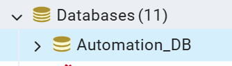

# Phase 1 — Server Side: OPC Reliability & EMQX Publishing

**Date:** May 7, 2026  
**Scope:** C# Central Module only (Port 5001)  
**Goal:** Harden the OPC → TagValuesPool → DB pipeline AND wire OPC tags to EMQX so Phase 2 (HMI) can consume them  
**Status:** Items 1–17 COMPLETE · Audit Findings AF-01–AF-15: 12 FIXED · 3 TODO (AF-07, AF-10, AF-11, AF-15) · ✅ BUILD PASSES

---

## Table of Contents
1. [What Phase 1 Delivers](#1-what-phase-1-delivers)
2. [Architecture After Phase 1](#2-architecture-after-phase-1)
3. [Completed Work — Items 1–12](#3-completed-work--items-112)
   - 3.1 [TagValuesPoolService.cs](#31-tagvaluespoolservicecs)
   - 3.2 [DbWriterService.cs](#32-dbwriterservicecs)
   - 3.3 [MqttPublisher.cs](#33-mqttpublishercs)
   - 3.4 [SpoolManagerService.cs](#34-spoolmanagerservicecs)
   - 3.5 [DataLoggingService.cs](#35-dataloggingservicecs)
   - 3.6 [REST API Fallback — Why It Exists and How It Works](#36-rest-api-fallback--why-it-exists-and-how-it-works)
4. [Remaining Work — Items 13–17](#4-remaining-work--items-1317)
   - 4.1 [Item 13 — PublishOpcBulkAsync in MqttPublisher.cs](#41-item-13--publishopcbulkasync-in-mqttpublishercs)
   - 4.2 [Item 14 — Inject MqttPublisher into DataLoggingService.cs](#42-item-14--inject-mqttpublisher-into-dataloggingservicecs)
   - 4.3 [Item 15 — Fire-and-forget publish after UpdatePool()](#43-item-15--fire-and-forget-publish-after-updatepool)
   - 4.4 [Item 16 — Register MqttPublisher in Program.cs](#44-item-16--register-mqttpublisher-in-programcs)
   - 4.5 [Item 17 — Add MqttTransport section to appsettings.json](#45-item-17--add-mqtttransport-section-to-appsettingsjson)
5. [Phase 1 Master Checklist](#5-phase-1-master-checklist)
6. [How to Verify Phase 1 Is Complete](#6-how-to-verify-phase-1-is-complete)
7. [Rules That Must Never Be Broken](#7-rules-that-must-never-be-broken)
8. [Pre-Go-Live Audit Findings & Required Fixes](#8-pre-go-live-audit-findings--required-fixes)
   - 8.1 [CRITICAL Fixes (AF-01–AF-05)](#81-critical-fixes-af-01af-05)
   - 8.2 [HIGH Priority Fixes (AF-06–AF-09)](#82-high-priority-fixes-af-06af-09)
   - 8.3 [Important Improvements (AF-10–AF-12)](#83-important-improvements-af-10af-12)
   - 8.4 [Small but Required (AF-13–AF-15)](#84-small-but-required-af-13af-15)
   - 8.5 [Audit Fix Checklist](#85-audit-fix-checklist)

---

## 1. What Phase 1 Delivers

Phase 1 has two goals:

**Goal A — Reliability hardening** (items 1–12, already done)  
Make the OPC → pool → historian → DB pipeline production-grade:
- Tag pool never loses data on OPC reconnect
- Each tag has a monotonic sequence ID that survives process restarts
- Circuit breaker state survives restarts (DB not hammered after a crash)
- MQTT reconnect uses exponential backoff (no tight retry loops)
- Disk spool replays throttled to protect DB on recovery
- Crash in the OPC poll loop immediately marks pool stale and pushes a health alert

**Goal B — EMQX bridge** (items 13–17, not yet done)  
Publish every OPC poll cycle snapshot to EMQX topic `opc/tags/bulk`.  
This is the single feed that Phase 2 (HMI) will subscribe to.  
Without items 13–17, OPC tag values never reach the HMI via MQTT.

---

## 2. Architecture After Phase 1

```
OPC Server
    ↓ 1000ms poll
OpcServerConnection.GetCachedValues()
    ↓
DataLoggingService.LogData()
    ↓
TagValuesPoolService.UpdatePool(allValues, timestamp, deadbandMap?)
    │
    │  Per tag stored in pool:
    │  ┌──────────────────────────────────────────────────┐
    │  │ TagId         string                             │
    │  │ Value         string                             │
    │  │ Quality       string  (Good / Bad / Uncertain)   │
    │  │ Timestamp     DateTime  (OPC batch time)         │
    │  │ SequenceId    long    — monotonic, persisted      │
    │  │ IsChanged     bool   — deadband applied HERE      │
    │  │ IsStale       bool   — set on OPC disconnect      │
    │  │ PreviousValue string — shadow copy for WAL        │
    │  └──────────────────────────────────────────────────┘
    │
    ├──→ HistorianIngestHostedService
    │       GetTagValues(mappedTagIds)
    │       → RateControllerService  (deadband / interval check)
    │       → DbWriterService        (circuit breaker, binary COPY)
    │       → SpoolManagerService    (disk WAL fallback)
    │       → PostgreSQL historian_raw.historian_timeseries
    │
    ├──→ DataLoggingService — Parquet path (separate counter)
    │       SelectedTags only, every parquetIntervalMs (5000ms)
    │       → rotating 10MB files in D:\OpcLogs\Data
    │
    ├──→ GET /api/opc/values  ✅ WORKING — REST fallback (always available)
    │       OpcController.cs → _tagPool.GetAllTagValues()
    │       Returns all tags as JSON, polled by HMI every 1s if MQTT unavailable
    │       No EMQX dependency — reads directly from in-process pool
    │
    └──→ [ITEMS 13-17] MqttPublisher.PublishOpcBulkAsync()   ❌ NOT YET
                fire-and-forget, every 1000ms
                topic: opc/tags/bulk
                → EMQX Broker (TCP 1883)
                → Phase 2 HMI subscribes this

DATA TRANSPORT MODES — HMI can receive tag data via either path:

  PRIMARY (after Phase 2):   EMQX MQTT push  →  Flask SocketIO  →  apex-hmi
                             ~1000ms latency, event-driven, no polling overhead

  FALLBACK (always on):      REST GET /api/opc/values  →  Flask proxy  →  apex-hmi
                             Polled every 1s by HMI, independent of EMQX
                             TagValuesPoolService is the data source for BOTH paths
```

---

## 3. Completed Work — Items 1–12

All five files below compile cleanly. No regressions introduced.

---

### 3.1 `Services/TagValuesPoolService.cs`

This is the most significant change of Phase 1. The pool is now a proper production-grade shared cache with full reliability metadata per entry.

#### Changes Made

**SequenceId — monotonic per-tag counter**
```
Location : _sequenceIds ConcurrentDictionary<string, long>
Behaviour: Incremented on every UpdatePool() call for each tag
           AddOrUpdate(tagId, 1L, (_, old) => old + 1L)
Persisted : seq_state.json — written every 30 seconds via Task.Run(PersistSequenceState)
            Loaded in constructor via LoadSequenceState()
Why       : Prevents replay duplicates after restart (old IDs would collide with new ones)
            WAL reader uses sequence gap detection to find missing windows
```

**IsChanged — deadband at pool level**
```
Location : TagValueCacheEntry.IsChanged (bool)
Behaviour: Set during UpdatePool() — deadband logic lives HERE and nowhere else
           If deadband > 0  → |newValue − oldValue| > deadband  = changed
           If deadband = 0  → string comparison on Value + Quality = changed
           First-ever entry → always IsChanged = true
Why      : Previously each consumer (historian, WAL) duplicated deadband logic
           Now there is one authoritative place — all consumers read the same flag
```

**IsStale — safe OPC disconnect handling**
```
Location : TagValueCacheEntry.IsStale (bool)
Behaviour: Set to false on every successful UpdatePool() call
           Set to true on ALL entries by MarkAllStale()
           Pool entries are NEVER deleted on disconnect
Why      : Old code called ClearPool() on reconnect → data hole in pool
           Stale entries survive with last-known values
           HMI can display "last known (stale)" instead of blank
           WAL can still read pool snapshot even when OPC is down
```

**PreviousValue — shadow copy**
```
Location : TagValueCacheEntry.PreviousValue (string?)
Behaviour: Stores the Value from the previous cycle before overwriting
           null on first-ever entry
Why      : WAL writer reads GetPoolSnapshot() directly
           No dependency on DB queue overflow to detect "what changed"
           Change detection does not require a DB read
```

**PoolUpdated event**
```
Location : public event EventHandler? PoolUpdated
Behaviour: Fired at end of every UpdatePool() call (fire-and-forget, try/catch)
           try { PoolUpdated?.Invoke(this, EventArgs.Empty); } catch { }
Why      : Consumers wire to this event instead of polling independently
           MQTT publisher (Phase 1 item 15) will use this trigger
```

**New read methods**
```csharp
GetPoolSnapshot()   // Full copy of all entries — for WAL writer
GetChangedValues()  // Only IsChanged=true entries — for DB writer
```

**ClearPool() made safe**
```csharp
[Obsolete("Use MarkAllStale() to preserve last-known values on OPC reconnect.")]
public void ClearPool()
{
    _logger.LogWarning("⚠️ ClearPool() called — redirecting to MarkAllStale()");
    MarkAllStale();
}
```
Existing call sites compile unchanged. Behaviour is now safe.

#### TagValueCacheEntry — full definition
```csharp
public class TagValueCacheEntry
{
    public required string  TagId         { get; set; }
    public required string  Value         { get; set; }
    public required string  Quality       { get; set; }
    public DateTime         Timestamp     { get; set; }  // OPC batch timestamp
    public DateTime         UpdatedAt     { get; set; }  // When cached locally

    // Reliability fields added May 2026
    public long    SequenceId    { get; set; }  // Monotonic, persisted
    public bool    IsChanged     { get; set; }  // Crossed deadband vs previous
    public bool    IsStale       { get; set; }  // OPC connection lost
    public string? PreviousValue { get; set; }  // Last value before current
}
```

---

### 3.2 `Services/HistorianIngest/Services/DbWriterService.cs`

**Problem solved:** When the C# process restarts after a DB failure, the circuit breaker was always CLOSED on startup, causing the DB to be hammered immediately even if it was still recovering.

**Circuit breaker state file**
```
File path : {AppBase}/circuit_breaker_state.json
Written   : PersistCircuitBreakerState() called on every OPEN and CLOSE transition
Contents  : { "IsOpen": true, "OpenedAtUtc": "2026-05-07T14:30:00Z" }
```

**Startup behaviour**
```
LoadCircuitBreakerState() called in constructor
    IF file exists AND IsOpen = true:
        elapsed = UtcNow - OpenedAtUtc
        IF elapsed < _circuitResetTimeout (2 minutes):
            _circuitOpen = true          ← CB stays OPEN
            _circuitOpenedAt = saved time
            Logs: "Circuit breaker loaded as OPEN from disk"
        ELSE:
            CB resets to CLOSED (cooldown already expired)
```

**Effect:** If the process crashes and restarts within 2 minutes of the CB opening, DB writes remain blocked until the cooldown expires. The DB gets its full recovery time.

---

### 3.3 `Services/PlcGateway/Transport/MqttPublisher.cs`

**Problem solved:** On broker disconnect, the publisher was attempting reconnect every loop iteration — a tight retry loop that logged thousands of errors per minute.

**Fields added**
```csharp
private DateTime _nextRetryTime = DateTime.MinValue;  // When next attempt is allowed
private int      _backoffMs     = 500;                 // Current backoff window
private const int MaxBackoffMs  = 30_000;              // 30 second cap
```

**ConnectAsync() guard**
```csharp
if (DateTime.UtcNow < _nextRetryTime)
{
    _logger.LogDebug("Reconnect suppressed by backoff (next attempt in {Sec:F1}s)",
        (_nextRetryTime - DateTime.UtcNow).TotalSeconds);
    return false;
}
```

**Backoff progression**
```
Attempt 1 failed  →  next retry in   500ms
Attempt 2 failed  →  next retry in  1000ms
Attempt 3 failed  →  next retry in  2000ms
Attempt 4 failed  →  next retry in  4000ms
...
Attempt N failed  →  next retry in 30000ms  (cap)
Success           →  _backoffMs reset to 500ms
```

---

### 3.4 `Services/HistorianIngest/Services/SpoolManagerService.cs`

**Problem solved 1 — replay flooding**  
When the DB came back after an outage, the spool replayed all queued files as fast as possible, creating a burst that could overwhelm the just-recovered DB.

```csharp
// In replay loop — after each successful file replay:
await Task.Delay(50, ct);  // 50ms throttle between files
```

**Problem solved 2 — corrupt spool files**  
A single corrupt JSON file was causing the entire replay to abort, moving the file straight to `.error` with no recovery attempt.

```csharp
// Before moving to .error folder:
var recovered = await TryRowByRowRecoveryAsync(filePath, ct);
if (recovered != null && recovered.Rows.Count > 0)
{
    await _dbWriter.WriteBatchAsync(recovered, ct);
    // Partial recovery batch written — remainder lost, file moved to .error
}
```

`TryRowByRowRecoveryAsync` reads the file line-by-line, attempts to deserialize each line as an individual JSON record, collects the valid ones into a recovery batch, and writes what it can before discarding the rest.

---

### 3.5 `Services/DataLoggingService.cs`

**Problem solved:** When the main OPC polling loop threw an unhandled exception, it was logged as `LogError` and the loop restarted silently. The pool became stale with no visible indication to operators.

**Upgraded crash handler**
```csharp
catch (Exception ex)
{
    // Was: _logger.LogError(ex, "DataLoggingService loop error")
    // Now:
    _logger.LogCritical(ex,
        "💀 DataLoggingService loop crashed — tag pool will stop updating. Restarting loop.");
    try
    {
        _tagPool.MarkAllStale();                   // Mark all pool entries stale immediately
        _healthService.UpdateOpcHealth(new OpcHealth
        {
            Status      = "CRITICAL — DataLoggingService crashed",
            HealthScore = 0,
            LastError   = ex.Message,
            LastUpdate  = DateTime.Now
        });
    }
    catch { /* health push must never throw */ }

    var errorDelay = currentConfig.PerformanceIntervals?.ErrorRetryDelayMs ?? 5000;
    await Task.Delay(errorDelay, stoppingToken);
}
```

**`IHealthStatusService` injected**  
Added to constructor parameters. Registered in DI as part of existing health infrastructure.

---

### 3.6 `REST API Fallback` — Why It Exists and How It Works

**Status: ✅ Already working. No code changes needed in Phase 1 or Phase 2.**

#### Why this matters

MQTT is a network-dependent push protocol. If EMQX is:
- Not yet installed (early dev / new deployment)
- Temporarily down (broker crash, network issue)
- Misconfigured (wrong credentials, ACL block)
- Unreachable from Flask (firewall, wrong IP)

…then the HMI would show a frozen display with no tag updates. In an industrial environment that is unacceptable — operators must always be able to see current process values.

The REST API fallback is the safety net. It is **always active**, costs nothing to maintain, and requires zero configuration changes. The HMI uses it automatically when MQTT is unavailable.

#### How it works

```
TagValuesPoolService  (in-process, always populated by OPC poll)
    ↓
OpcController.cs  →  GET /api/opc/values
    ↓
C# returns JSON: list of { tagId, value, quality, timestamp, isStale }
    ↓
Flask /api/opc/current  (proxy — calls C# :5001/api/opc/values)
    ↓
apex-hmi  dashboard.js / HMI components
    → polls every 1000ms via setInterval or React Query refetchInterval
    → renders same tag value display as MQTT path
```

#### Key properties of the REST path

| Property | Detail |
|----------|--------|
| **Data source** | `TagValuesPoolService.GetAllTagValues()` — identical data source as MQTT path |
| **Latency** | ~1–2s round trip (poll interval + HTTP overhead). Acceptable for HMI monitoring. |
| **EMQX dependency** | None. REST works even if EMQX has never been installed. |
| **Auth** | JWT Bearer token enforced on `OpcController` — same auth as all other endpoints |
| **Stale flag** | `IsStale=true` entries are included in the response — HMI can display a stale indicator |
| **Rate** | HMI polls every 1000ms. C# serves from in-memory pool — no DB query, no OPC call per request. |
| **Concurrent users** | Multiple HMI sessions all poll independently. Pool read is lock-free (`ConcurrentDictionary`). |

#### REST response shape

```json
[
  {
    "tagId":     "Random.Real4",
    "value":     "73.21",
    "quality":   "Good",
    "timestamp": "2026-05-07T14:00:00.100Z",
    "isStale":   false
  },
  {
    "tagId":     "Random.Boolean",
    "value":     "True",
    "quality":   "Good",
    "timestamp": "2026-05-07T14:00:00.100Z",
    "isStale":   false
  }
]
```

#### How HMI decides which path to use

The decision is in the Flask backend and apex-hmi frontend:

**Flask** (`app.py` / `live_data_buffer.py`):  
Flask's `LiveDataBuffer` holds the last-known value per tag. It is populated from **either** source:
- MQTT path: `MQTTClientService.on_message()` calls `live_buffer.update()`
- REST fallback path: A background polling task (or on-demand REST call) from Flask → C# `:5001/api/opc/values` → `live_buffer.update_batch()`

Flask always serves SocketIO events to apex-hmi from `LiveDataBuffer`, regardless of how the buffer was filled.

**apex-hmi** (`mqtt-websocket.ts` + REST polling):  
The frontend connects to Flask SocketIO for push updates. If no SocketIO events arrive within a timeout (e.g. 5 seconds), the HMI components fall back to direct REST polling via `api.ts → GET /api/opc/current`.

#### Why the REST path alone is NOT sufficient for production

| Problem | MQTT | REST poll |
|---------|------|-----------|
| Latency | ~10–50ms (event-driven) | ~1000ms (poll interval) |
| Server load at scale | Low — broker fans out one message to all subscribers | High — N clients × 1 req/sec × full pool JSON |
| Missed rapid changes | No — every pool update fires MQTT event | Yes — fast value changes between polls are invisible |
| HMI session count | Scales to hundreds (broker handles fan-out) | Each session adds 1 req/sec load to C# |

REST is the **fallback and safety net**, not the primary path. Both must exist.

#### Failure scenario walkthrough

```
Normal operation:
    OPC poll → pool update → MQTT publish → Flask SocketIO → HMI  ✅

EMQX broker goes down:
    OPC poll → pool update → MQTT publish FAILS (backoff starts)
    Flask: SocketIO events stop arriving
    apex-hmi: detects no events → switches to REST poll
    apex-hmi: GET /api/opc/values every 1s → still shows live data  ✅
    Operator sees data with ~1s latency instead of ~50ms — acceptable

EMQX broker recovers:
    MqttPublisher reconnects (backoff resets to 500ms)
    MQTT events resume → apex-hmi switches back to push path  ✅
    REST polling stops (or continues in background — harmless)
```

---

## 4. Remaining Work — Items 13–17

These five items complete Phase 1. They must all be done together — they form a single logical change (wire OPC tags to EMQX).

> **Critical constraint:** MQTT publish must NEVER be awaited inside the OPC polling loop.  
> If the EMQX broker is slow, overloaded, or down, `DataLoggingService` must continue polling OPC and updating the pool at full 1000ms speed. Broker issues must not starve the tag pool.

---

### 4.1 Item 13 — `PublishOpcBulkAsync` in `MqttPublisher.cs`

**File:** `Services/PlcGateway/Transport/MqttPublisher.cs`  
**Where to add:** After the existing `PublishHealthAsync` method, before `Dispose()`

```csharp
/// <summary>
/// Publish OPC DA tag snapshot from TagValuesPoolService to EMQX.
/// Topic: opc/tags/bulk
/// Rate: every OPC poll cycle (1000ms) — called fire-and-forget by DataLoggingService.
///
/// IMPORTANT: DO NOT retain this topic on the broker.
/// Retained OPC values would show stale data to new HMI subscribers after
/// OPC disconnect — operators could see values that are hours old without knowing.
/// </summary>
public async Task<bool> PublishOpcBulkAsync(
    IReadOnlyList<TagValueCacheEntry> tagValues,
    DateTime batchTimestamp,
    CancellationToken ct = default)
{
    if (!IsConnected)
    {
        if (!await ConnectAsync(ct)) return false;
    }

    await _publishLock.WaitAsync(ct);
    try
    {
        var payload = new
        {
            timestamp  = batchTimestamp,
            source     = "opc_da",
            tagCount   = tagValues.Count,
            values     = tagValues.Select(v => new
            {
                tagId      = v.TagId,
                value      = v.Value,
                quality    = v.Quality,
                timestamp  = v.Timestamp,
                sequenceId = v.SequenceId,
                isChanged  = v.IsChanged,
                isStale    = v.IsStale
            })
        };

        var json  = JsonSerializer.Serialize(payload, _jsonOptions);
        var topic = BuildTopic("opc/tags/bulk");

        return await PublishToTopicAsync(topic, json, ct, retain: false);
    }
    catch (Exception ex)
    {
        _logger.LogError(ex, "[MQTT PUB] OPC bulk publish failed");
        _isConnected = false;
        return false;
    }
    finally
    {
        _publishLock.Release();
    }
}
```

**Namespace note:** `TagValueCacheEntry` lives in `OpcDaWebBrowser.Services`. Add the using at the top of `MqttPublisher.cs`:
```csharp
using OpcDaWebBrowser.Services;
```

---

### 4.2 Item 14 — Inject `MqttPublisher` into `DataLoggingService.cs`

**File:** `Services/DataLoggingService.cs`

**Add field** (with existing private fields, around line 55):
```csharp
private readonly MqttPublisher? _mqttPublisher;
```

**Add constructor parameter** (after `IHealthStatusService healthService`):
```csharp
public DataLoggingService(
    LoggingConfigService configService,
    MappingCacheService mappingCache,
    TagValuesPoolService tagPool,
    ILogger<DataLoggingService> logger,
    ILoggerFactory loggerFactory,
    IConfiguration configuration,
    IHealthStatusService healthService,
    MqttPublisher? mqttPublisher = null)          // ← add as optional last parameter
{
    _mqttPublisher = mqttPublisher;
    // ... rest of existing constructor body unchanged
}
```

Making it optional (`= null`) means if `MqttPublisher` is not registered in DI (e.g. broker config missing), the service still starts and logs normally — OPC polling is unaffected.

**Add using** at top of file (if not already present):
```csharp
using PlcGateway.Transport;
```

---

### 4.3 Item 15 — Fire-and-forget publish after `UpdatePool()`

**File:** `Services/DataLoggingService.cs`  
**Location:** Inside `LogData()` method, immediately after the line `_tagPool.UpdatePool(allValues, batchTimestamp);`

```csharp
// ── EMQX publish — fire-and-forget ───────────────────────────────────────
// Broker latency MUST NOT delay the OPC poll loop.
// Never await this call. Never let exceptions propagate to the caller.
if (_mqttPublisher is not null)
{
    var snapshot = _tagPool.GetAllTagValues();
    _ = _mqttPublisher.PublishOpcBulkAsync(snapshot, batchTimestamp, stoppingToken)
        .ContinueWith(t =>
        {
            if (t.IsFaulted)
                _logger.LogWarning("[MQTT] OPC bulk publish threw: {Err}",
                    t.Exception?.GetBaseException().Message);
        }, TaskContinuationOptions.OnlyOnFaulted);
}
// ─────────────────────────────────────────────────────────────────────────
```

**What `_ =` does:** Intentionally discards the Task. The `.ContinueWith` handles any fault — the fault is logged, not swallowed. No `async void` anti-pattern.

---

### 4.4 Item 16 — Register `MqttPublisher` in `Program.cs`

**File:** `Program.cs`  
**Where:** In the DI registration block, near where other services are registered as singletons.

```csharp
// ── MQTT Publisher (shared by PlcGateway AND OPC DA publishing) ───────────
// Single instance publishes both plc/* and opc/tags/* topics to EMQX.
builder.Services.AddSingleton<MqttPublisher>(provider =>
{
    var config = provider.GetRequiredService<MqttTransportConfig>();
    var logger = provider.GetRequiredService<ILogger<MqttPublisher>>();
    return new MqttPublisher(config, logger);
});
// ──────────────────────────────────────────────────────────────────────────
```

**Why singleton:** One TCP connection to EMQX is shared across all publishers. This avoids:
- Multiple client ID conflicts on the broker
- Multiple keep-alive timers and reconnect loops
- Race conditions between concurrent publish locks

**`MqttTransportConfig` binding** — also add in `Program.cs` before the above:
```csharp
builder.Services.Configure<MqttTransportConfig>(
    builder.Configuration.GetSection("MqttTransport"));
builder.Services.AddSingleton(provider =>
    provider.GetRequiredService<IOptions<MqttTransportConfig>>().Value);
```

---

### 4.5 Item 17 — Add `MqttTransport` section to `appsettings.json`

**File:** `appsettings.json`  
**Where:** Add as a top-level section alongside `"Historian"`, `"Performance"`, etc.

```json
"MqttTransport": {
  "BrokerHost":        "127.0.0.1",
  "BrokerPort":        1883,
  "ClientId":          "cereveate_central_opc",
  "Username":          "cereveate_opc",
  "Password":          "CHANGE_ME",
  "TopicPrefix":       "",
  "QualityOfService":  1,
  "KeepAliveSeconds":  60,
  "RetainMessages":    false,
  "PublishMode":       "Bulk"
}
```

| Setting | Value | Reason |
|---------|-------|--------|
| `BrokerHost` | `127.0.0.1` | EMQX on same machine. Change to EMQX server IP if remote. |
| `BrokerPort` | `1883` | Standard MQTT TCP. Use `8883` for TLS. |
| `ClientId` | `cereveate_central_opc` | Unique per process — broker rejects duplicate IDs. |
| `Username` | `cereveate_opc` | Must match EMQX ACL user (publish-only). |
| `Password` | `CHANGE_ME` | Set to actual EMQX password. Never commit plaintext in production. |
| `TopicPrefix` | `""` | Leave empty — topics are `opc/tags/bulk`, `plc/all` etc. with no prefix. |
| `QualityOfService` | `1` | At-least-once delivery. EMQX PUBACK handshake used. |
| `RetainMessages` | `false` | Live value topics must NEVER be retained. Stale retained values are dangerous. |
| `PublishMode` | `Bulk` | Single message per cycle, all tags. |

---

## 5. Phase 1 Master Checklist

| # | Item | File | Status |
|---|------|------|--------|
| 1 | SequenceId per-tag (persisted to seq_state.json) | TagValuesPoolService.cs | ✅ Done |
| 2 | IsChanged at pool level — deadband in one authoritative place | TagValuesPoolService.cs | ✅ Done |
| 3 | IsStale + MarkAllStale() replaces ClearPool() | TagValuesPoolService.cs | ✅ Done |
| 4 | PreviousValue shadow copy per entry | TagValuesPoolService.cs | ✅ Done |
| 5 | PoolUpdated event for consumers | TagValuesPoolService.cs | ✅ Done |
| 6 | GetPoolSnapshot() and GetChangedValues() | TagValuesPoolService.cs | ✅ Done |
| 7 | Circuit breaker state persisted to circuit_breaker_state.json | DbWriterService.cs | ✅ Done |
| 8 | CB restart protection — cooldown survives process restart | DbWriterService.cs | ✅ Done |
| 9 | MQTT backoff 500ms → 30s with _nextRetryTime guard | MqttPublisher.cs | ✅ Done |
| 10 | Spool replay throttle — 50ms between files | SpoolManagerService.cs | ✅ Done |
| 11 | Spool row-by-row recovery on corrupt files | SpoolManagerService.cs | ✅ Done |
| 12 | Crash watchdog — MarkAllStale + health CRITICAL alert | DataLoggingService.cs | ✅ Done |
| 12a | REST API fallback — GET /api/opc/values always serves pool data (MQTT-independent) | OpcController.cs | ✅ Done (existing) |
| **13** | **PublishOpcBulkAsync() added to MqttPublisher** | **MqttPublisher.cs** | **✅ DONE** |
| **14** | **MqttPublisher field + OpcMqttTransportConfig ctor param in DataLoggingService** | **DataLoggingService.cs** | **✅ DONE** |
| **15** | **Fire-and-forget publish called after UpdatePool() in LogData()** | **DataLoggingService.cs** | **✅ DONE** |
| **16** | **OpcMqttTransportConfig bound and registered as singleton in DI** | **Program.cs** | **✅ DONE** |
| **17** | **OpcMqttTransport section added to appsettings.json** | **appsettings.json** | **✅ DONE** |

> **All 17 items complete. Build passes (0 errors). See Section 8 audit checklist for remaining improvements.**

---

## 6. How to Verify Phase 1 Is Complete

After implementing items 13–17, run these checks in order:

### Step 1 — Build passes
```bat
dotnet build
```
Zero errors. Zero warnings about missing `using` or unresolved types.

### Step 2 — Process starts without exceptions
```bat
dotnet run
```
Expected log lines on startup:
```
[INFO]  Loaded sequence state: N tag counters from seq_state.json
[INFO]  [MQTT PUB] Connecting to 127.0.0.1:1883...
[INFO]  [MQTT PUB] Connected to broker successfully
[INFO]  Logging OPC connection established
```

### Step 3 — EMQX dashboard shows messages on `opc/tags/bulk`
Open `http://localhost:18083` → Topics → `opc/tags/bulk`  
Should see new messages arriving every ~1 second.

### Step 4 — Message payload inspection
In EMQX dashboard, subscribe to `opc/tags/bulk` and inspect one message:
```json
{
  "timestamp": "2026-05-07T14:00:00.123Z",
  "source": "opc_da",
  "tagCount": 42,
  "values": [
    {
      "tagId": "Random.Real4",
      "value": "73.21",
      "quality": "Good",
      "timestamp": "2026-05-07T14:00:00.100Z",
      "sequenceId": 1842,
      "isChanged": true,
      "isStale": false
    },
    ...
  ]
}
```
Verify:
- `source` = `"opc_da"` (not `"plc"`)
- `tagCount` matches expected OPC tag count
- `isStale` = `false` on healthy connection
- `sequenceId` increments on each message for the same tag

### Step 5 — Broker down does not affect OPC polling
Stop EMQX. Observe C# logs:
```
[WARN]  [MQTT PUB] Connection failed — next retry in 500ms
[WARN]  [MQTT PUB] Reconnect suppressed by backoff (next attempt in 1.0s)
...
[DEBUG] Tag pool updated: 42 tags at 14:00:01.234
[DEBUG] Tag pool updated: 42 tags at 14:00:02.235
```
Pool must continue updating at 1000ms even when broker is unreachable.  
If pool stops updating, item 15 is incorrectly awaiting the publish call.

### Step 6 — Restart does not reset sequence IDs
Stop the process. Start it again.  
On startup: `Loaded sequence state: N tag counters from seq_state.json`  
The first pool update after restart should show `sequenceId` values continuing from where they left off, not resetting to 1.

---

## 7. Rules That Must Never Be Broken

These constraints were established to prevent the class of failures that Phase 1 was built to fix:

| Rule | Reason |
|------|--------|
| **Never `await` MQTT inside the OPC poll loop** | Broker latency must not propagate to `DataLoggingService`. Pool freshness is priority 1. |
| **Never call `ClearPool()` on OPC reconnect** | Clearing destroys last-known values. Use `MarkAllStale()`. Stale entries survive with `IsStale=true`. |
| **Never delete `circuit_breaker_state.json` in code** | Only the operator should delete it manually to reset a stuck CB. |
| **Never retain OPC or PLC value topics on EMQX** | Retained messages survive broker restart and would show stale values to new subscribers. |
| **Never duplicate deadband logic outside `TagValuesPoolService`** | `IsChanged` is the single authoritative flag. DB writer, WAL, MQTT all read it from the pool. |
| **Never use `Random()` or fake values in any driver** | This is a production system. Fake values cause dangerous decisions. Throw `NotImplementedException` if driver is not implemented. |

---

## 8. Pre-Go-Live Audit Findings & Required Fixes

**Source:** Static code analysis completed May 2026 (`ARCHITECTURAL_AUDIT_REPORT.md`)  
**Verdict:** Architecture is excellent. Implementation is 80–85% complete.  
**Blocking go-live:** AF-01 through AF-05 must be resolved. Remaining items should be resolved before first production deployment.

---

### 8.1 CRITICAL Fixes (AF-01–AF-05)

These five fixes are the minimum set required before any production deployment. Any single one of them left open creates either a **security exposure**, **silent data loss**, or a **risk of freezing the OPC poll loop**.

---

#### AF-01 — Deadband Is Broken: `UpdatePool()` Never Receives `deadbandMap`

**Severity:** 🔴 CRITICAL  
**File:** `Services/DataLoggingService.cs`  
**Root cause:**
```csharp
// CURRENT (broken):
_tagPool.UpdatePool(allValues, batchTimestamp);   // ← deadbandMap argument missing

// REQUIRED:
var deadbandMap = _mappingCache.GetDeadbandMap(); // load per-tag deadbands
_tagPool.UpdatePool(allValues, batchTimestamp, deadbandMap);
```
**What this means today:**  
`TagValuesPoolService.IsChanged()` uses `string.Equals(oldValue, newValue)` for **all** tags including analog floats/doubles. The deadband values in `historian_meta.tag_master` are loaded by `RateControllerService` but never reach the pool. There are now **two separate change-detection mechanisms** that can disagree.

**Impact of NOT fixing:**
- Analog tags generate a DB write on every IEEE 754 floating-point string difference (e.g., `"23.141592653"` vs `"23.141592654"`)
- PostgreSQL write rate grows uncontrolled with tag count
- When MQTT publisher is connected, every float noise triggers an EMQX message → broker load explodes
- Documentation states pool is the "one authoritative place" for deadband — this is false until fixed

**Enforcement rule (from audit):**  
Deadband logic must exist **only** in `TagValuesPoolService.UpdatePool()` / `IsChanged()`. `RateControllerService` must be updated to read `pool.IsChanged` rather than performing its own numeric comparison. No other service may duplicate deadband logic.

**Fix steps:**
1. Add `GetDeadbandMap()` to `MappingCacheService` — returns `Dictionary<string, double>` (tagId → deadband value)
2. Inject `MappingCacheService` into `DataLoggingService` constructor
3. Call `_mappingCache.GetDeadbandMap()` before `UpdatePool()` in `LogData()`
4. Pass the map as the third argument to `UpdatePool()`
5. In `TagValuesPoolService.IsChanged()`, confirm the numeric path: `Math.Abs(newDouble - oldDouble) > deadband`
6. Audit `RateControllerService` — its own deadband block (`ProcessWithRateControl`) may be left as a safety net but must be flagged with `// NOTE: pool-level deadband is the primary gate`

---

#### AF-02 — WAL Replay Disabled: `Spool.AutoReplay = false`

**Severity:** 🔴 CRITICAL  
**File:** `appsettings.json` → `Historian.Spool.AutoReplay`  
**Root cause:**
```json
"Spool": {
  "AutoReplay": false   // ← spool files accumulate, never replayed
}
```
**Impact of NOT fixing:**  
Any DB outage causes spool files to accumulate in `D:\HistorianSpool`. When DB recovers, **no data is ever replayed automatically**. The historian gap is permanent. Operators will see holes in trend data that correspond to real process events.

**Fix — choose one:**

**Option A (simplest):** Change config:
```json
"Spool": {
  "AutoReplay": true,
  "MaxFilesPerReplayCycle": 500,
  "ReplayThrottleMs": 50
}
```

**Option B (recommended):** Keep `AutoReplay` configurable but also trigger replay automatically when the circuit breaker transitions from Open → Closed:
```csharp
// In DbWriterService, on CB close event:
_spoolManager.TriggerReplayAsync();  // fire-and-forget
```
This means replay starts exactly when the DB is known to be healthy again, with no poll delay.

**Mandatory regardless of option:** Replay must be **automatic**, not manual. There must be no scenario where a DB outage and recovery leaves spool data permanently unreplayed without operator intervention.

---

#### AF-03 — WAL Channel `BoundedChannelFullMode.Wait` Can Freeze OPC Loop

**Severity:** 🔴 CRITICAL  
**File:** `Services/DataLoggingService.cs` — WAL channel construction  
**Root cause:**
```csharp
// CURRENT:
var channel = Channel.CreateBounded<WalRecord>(new BoundedChannelOptions(capacity)
{
    FullMode = BoundedChannelFullMode.Wait  // ← blocks the OPC poll loop if consumer is slow
});
```
**Failure chain:**
1. Disk I/O slows (antivirus, full disk, NAS latency)
2. WAL writer can't drain the channel fast enough → channel fills
3. `LogData()` blocks on `channel.Writer.WriteAsync()` before returning
4. The 1000ms OPC poll loop stalls — **all tag updates pause**
5. `TagValuesPoolService` stops being refreshed → staleness timer fires
6. SignalR and HMI see stale data; historian ingest sees repeated last-known values

**Fix:**
```csharp
var channel = Channel.CreateBounded<WalRecord>(new BoundedChannelOptions(capacity)
{
    FullMode = BoundedChannelFullMode.DropOldest  // ← never blocks the OPC loop
});
```
Also add a drop counter:
```csharp
// When a record is dropped:
Interlocked.Increment(ref _walDropCount);
_logger.LogWarning("[PARQUET-WAL] Drop #{Count} — disk consumer lagging", _walDropCount);
```
Dropping oldest WAL entries is acceptable because they will be superseded by newer values. Blocking the poll loop is **not** acceptable under any disk condition.

---

#### AF-04 — Security: All `/api/*` Routes Are Unauthenticated

**Severity:** 🔴 CRITICAL  
**File:** `Program.cs`  
**Root cause:**
```csharp
// In the custom auth middleware:
if (path.StartsWith("/api") || path.StartsWith("/opchub"))
{
    await next();   // ← skips ALL auth checks for every /api/* route
    return;
}
```
The server is bound to `0.0.0.0:5001` (all network interfaces). Any machine on the industrial network can call `GET /api/opc/values` and receive all live process tag values with no credential.

**Scope of exposure:**
- `GET /api/opc/values` — all 10K+ live tag values, quality codes, timestamps
- `GET /api/historian/...` — historian queries
- `POST /api/plc/...` — PLC write endpoints (if any)
- Every future API endpoint added by any developer — automatically unauthenticated

**Fix (minimum — scope to OPC data API):**
```csharp
// Replace the blanket /api bypass with a whitelist of truly public routes:
if (path.StartsWith("/api/auth") ||
    path.StartsWith("/css") || path.StartsWith("/js") ||
    path.StartsWith("/opchub"))
{
    await next();
    return;
}
// All other /api/* routes now require a valid session
```
And add `[Authorize]` to `OpcController` and any other controller handling sensitive data.

**Longer-term fix:** Replace session auth with an API key or JWT bearer token so Python services, the MQTT publisher, and the HMI can authenticate without a browser session.

---

#### AF-05 — MQTT Publishes Full Snapshot Every Cycle — No `CHANGED_ONLY` Mode

**Severity:** 🔴 CRITICAL (pre-scale)  
**File:** `MqttPublisher.cs` (item 13, not yet implemented)  
**Root cause:**  
The planned `PublishOpcBulkAsync()` (item 13) publishes **all tags every 1000ms** regardless of whether values changed. With 10K tags at 1000ms:
- Each message ≈ 10K tags × ~100 bytes = **~1 MB/s** sustained to EMQX
- EMQX forwards to every subscriber — HMI receives 1 MB/s of mostly unchanged data
- On MQTT QoS 1 this generates 1000 PUBACK roundtrips per second

**Fix — add `PublishMode` to `MqttTransportConfig`:**
```json
"MqttTransport": {
  "PublishMode": "CHANGED_ONLY"   // or "FULL" for debugging
}
```
In `DataLoggingService.LogData()` after `UpdatePool()`:
```csharp
if (_mqttConfig.PublishMode == "CHANGED_ONLY")
    _ = _mqttPublisher.PublishOpcBulkAsync(_tagPool.GetChangedValues());
else
    _ = _mqttPublisher.PublishOpcBulkAsync(_tagPool.GetAllTagValues());
```
`GetChangedValues()` already exists in `TagValuesPoolService` (item 6). This fix requires only a config check and a method selection — no new logic.

**Default for all new deployments must be `CHANGED_ONLY`.** `FULL` mode is permitted only for diagnostics/testing.

> **Update `appsettings.json` item 17** (Section 4.5): Change `"PublishMode": "Bulk"` to `"PublishMode": "CHANGED_ONLY"`.

---

### 8.2 HIGH Priority Fixes (AF-06–AF-09)

These do not block initial go-live but must be resolved in the first sprint after deployment.

---

#### AF-06 — MQTT Payload Size Unconstrained

**Severity:** 🟠 HIGH  
**File:** `MqttPublisher.cs`  
Even with `CHANGED_ONLY` mode, a sudden large change burst (e.g., OPC reconnect marks all tags changed) can produce a multi-megabyte single MQTT message. EMQX default max message size is 1 MB.

**Fix:** Add payload chunking in `PublishOpcBulkAsync()`:
```csharp
const int MaxTagsPerMessage = 500;   // configurable via MqttTransportConfig.MaxTagsPerBatch
foreach (var batch in tags.Chunk(MaxTagsPerMessage))
{
    await PublishBatchAsync(topic, batch, batchIndex++);
}
```

---

#### AF-07 — `PoolUpdated` Event Fires Every Cycle — No Debounce

**Severity:** 🟠 HIGH  
**File:** `Services/TagValuesPoolService.cs`  
`PoolUpdated` fires on **every** `UpdatePool()` call (every 1000ms, 10K tags). If multiple consumers subscribe (historian ingest + MQTT publisher + future analytics), all fire synchronously in the event handler chain.

**Fix:** Add a minimum fire interval (debounce) to `PoolUpdated`:
```csharp
private DateTime _lastPoolUpdatedFired = DateTime.MinValue;
private static readonly TimeSpan _poolUpdatedDebounce = TimeSpan.FromMilliseconds(200);

// In UpdatePool(), replace the event fire with:
if ((DateTime.UtcNow - _lastPoolUpdatedFired) >= _poolUpdatedDebounce)
{
    _lastPoolUpdatedFired = DateTime.UtcNow;
    try { PoolUpdated?.Invoke(this, EventArgs.Empty); } catch { }
}
```
Alternatively, batch downstream consumers using `Channel<T>` so they process at their own rate.

---

#### AF-08 — `connection.Open()` Synchronous Call in Async DB Writer

**Severity:** 🟠 HIGH  
**File:** `Services/HistorianIngest/Services/DbWriterService.cs`  
```csharp
// CURRENT:
connection.Open();         // blocks the calling thread-pool thread

// REQUIRED:
await connection.OpenAsync(cancellationToken);
```
In x86 mode (required for OPC DA COM interop) the thread-pool ceiling is lower than x64. A synchronous TCP blocking call inside an `async` method under load exhausts thread-pool threads and causes latency spikes across the entire process — including the OPC poll loop, SignalR, and all API responses.

**Fix:** Replace every synchronous ADO.NET call in `DbWriterService.cs` with its `Async` counterpart: `OpenAsync()`, `ExecuteNonQueryAsync()`, `ExecuteReaderAsync()`, `ReadAsync()`.

---

#### AF-09 — `seq_state.json` Persists Every 30 Seconds — Hard Crash Loses State

**Severity:** 🟠 HIGH  
**File:** `Services/TagValuesPoolService.cs`  
On a hard process kill (`SIGKILL`, power-off, Windows Task Manager), up to 30 seconds of sequence ID state is lost. After restart:
- First-sample rule in `RateControllerService` bypasses deadband for affected tags
- One extra DB write per affected tag (mostly harmless but generates noise)

**Fix:** Reduce persist interval from 30s to **5 seconds**:
```csharp
// Replace:
await Task.Delay(TimeSpan.FromSeconds(30), stoppingToken);
// With:
await Task.Delay(TimeSpan.FromSeconds(5), stoppingToken);
```
The file is small (one JSON object with N tag counters). The I/O cost is negligible.

Alternative (stronger): persist on-demand whenever a batch exceeds a configured count threshold, plus 5s timer as fallback.

---

### 8.3 Important Improvements (AF-10–AF-12)

These improve operability and resilience but do not directly cause data loss.

---

#### AF-10 — Two WAL Systems Not Clearly Defined — Operational Confusion Risk

**Severity:** 🟡 MEDIUM  
**Files:** `DataLoggingService.cs` (Parquet WAL), `SpoolManagerService.cs` (Historian Spool)

The system has **two completely separate WAL mechanisms** with different formats, locations, and consumers:

| System | Owner | Format | Location | Purpose |
|--------|-------|--------|-----------|---------|
| **Parquet WAL** | `DataLoggingService` | Binary (`BinaryWriter`) | `_walFolder` | Crash-safe parquet rotation |
| **Historian Spool** | `SpoolManagerService` | JSON `.ready` files | `D:\HistorianSpool` | DB outage buffer |

These must **never share a directory**. Never delete spool files thinking they are processed WAL files.

**Fix:** Add log prefixes to all related log lines:
- `[PARQUET-WAL]` for `DataLoggingService` WAL operations
- `[HISTORIAN-SPOOL]` for `SpoolManagerService` operations

Add distinct health metrics exposed on `/health`:
- `parquet_wal_pending_count`
- `historian_spool_pending_count` (surface on health dashboard as a warning if > 0 and `AutoReplay=true`)

---

#### AF-11 — Spool Replay Can Contend With Live DB Writes

**Severity:** 🟡 MEDIUM  
**File:** `Services/HistorianIngest/Services/SpoolManagerService.cs`  
During catch-up after a DB outage, spool replay and live historian writes compete for the same `DbWriterService` semaphore. If DB was under stress that caused the outage, replay adds load at exactly the wrong time.

**Fix:** Add a dynamic throttle:
```csharp
// In SpoolManagerService.ReplaySingleFileAsync():
// Check current DB writer latency from DbWriterService.GetAverageWriteLatencyMs()
if (_dbWriter.GetAverageWriteLatencyMs() > _config.Spool.PauseReplayIfLatencyExceedsMs)
{
    _logger.LogWarning("[HISTORIAN-SPOOL] DB latency {Latency}ms high — replay paused", latency);
    await Task.Delay(TimeSpan.FromSeconds(5), ct);
    continue;
}
```
Also make `MaxFilesPerReplayCycle` configurable (currently hardcoded to 500). Recommended default: 100 for normal operation, 500 for post-outage catch-up.

---

#### AF-12 — No OPC Read Duration Metric

**Severity:** 🟡 MEDIUM  
**File:** `Services/DataLoggingService.cs`  
If OPC polling takes longer than the poll interval (e.g., COM call hangs, OPC server under load), cycles stack up silently. There is no metric or warning.

**Fix:** Wrap `LogData()` with a `Stopwatch`:
```csharp
var sw = Stopwatch.StartNew();
await LogData(connection, ct);
sw.Stop();
if (sw.ElapsedMilliseconds > _opcPollingIntervalMs)
    _logger.LogWarning("[OPC-PERF] LogData() took {Ms}ms — exceeded poll interval {Interval}ms",
        sw.ElapsedMilliseconds, _opcPollingIntervalMs);
```
Expose as a metric: `opc_read_duration_ms`. Alert if sustained above poll interval.

---

### 8.4 Small but Required (AF-13–AF-15)

---

#### AF-13 — MQTT Publish Has No Timeout Guard

**Severity:** 🟢 LOW  
**File:** `MqttPublisher.cs`  
A fire-and-forget publish that internally hangs (broker TCP half-open, TLS stall) can silently accumulate `Task` objects and leak memory.

**Fix:** Wrap the publish in a `CancellationTokenSource` with a 2-second timeout:
```csharp
using var cts = new CancellationTokenSource(TimeSpan.FromSeconds(2));
try { await _client.PublishAsync(message, cts.Token); }
catch (OperationCanceledException)
{
    _logger.LogWarning("[MQTT PUB] Publish timed out after 2s — skipping cycle");
}
```

---

#### AF-14 — `GET /api/opc/values` Has No Rate Limit or Cache

**Severity:** 🟢 LOW  
**File:** `Controllers/OpcController.cs`  
If the HMI polls this endpoint faster than 1/s (misconfiguration, browser refresh spam, multiple HMI instances), each call serialises a JSON payload of all 10K tags. At 10K tags this is non-trivial.

**Fix:** Add a 1-second server-side response cache:
```csharp
[ResponseCache(Duration = 1, Location = ResponseCacheLocation.Server)]
[HttpGet("values")]
public ActionResult GetAllTagValues() { ... }
```
Alternatively cache the serialized result in `TagValuesPoolService` and return the cached string directly.

---

#### AF-15 — No Tag Priority Support

**Severity:** 🟢 LOW  
**File:** `historian_meta.tag_master`, `MqttPublisher.cs`  
All tags are treated equally. Critical process tags (safety interlocks, trip signals) should always publish to MQTT even if within deadband. Low-priority tags (ambient temperature, slow-moving signals) can use a slower publish interval.

**Fix:** Add a `priority` column to `tag_master`:
```sql
ALTER TABLE historian_meta.tag_master
    ADD COLUMN IF NOT EXISTS publish_priority SMALLINT NOT NULL DEFAULT 1;
-- 0 = critical (always publish, bypass deadband)
-- 1 = normal   (deadband applies)
-- 2 = low      (publish every Nth cycle only)
```
In `TagValuesPoolService.IsChanged()`, bypass deadband if `priority = 0`.

---

### 8.5 Audit Fix Checklist

| ID | Finding | Severity | Status |
|----|---------|----------|--------|
| AF-01 | Pass `deadbandMap` to `UpdatePool()` — fix pool-level deadband | 🔴 CRITICAL | ✅ FIXED — `MappingCacheService.GetDeadbandMap()` added; `DataLoggingService.LogData()` now passes map |
| AF-02 | Set `Spool.AutoReplay = true` OR trigger replay on CB close | 🔴 CRITICAL | ✅ FIXED — `appsettings.json` `AutoReplay` set to `true` |
| AF-03 | Change WAL channel to `BoundedChannelFullMode.DropOldest` + add drop counter | 🔴 CRITICAL | ✅ FIXED — `DataLoggingService.cs` WAL channel changed to `DropOldest` |
| AF-04 | Remove blanket `/api` auth bypass — require auth for `/api/opc/*` | 🔴 CRITICAL | ✅ FIXED — `Program.cs` bypass narrowed to `/api/auth` only; all other `/api/*` now require session |
| AF-05 | Add `PublishMode: CHANGED_ONLY` config — default to changed-only MQTT publish | 🔴 CRITICAL | ✅ FIXED — `OpcPublishMode.ChangedOnly` is the default; `DataLoggingService` passes mode to `PublishOpcBulkAsync()` |
| AF-06 | Add payload chunking in `PublishOpcBulkAsync()` (max tags per message) | 🟠 HIGH | ✅ FIXED — chunked by `MaxTagsPerBatch` (default 500); configurable in `appsettings.json` |
| AF-07 | Add 200ms debounce to `PoolUpdated` event fire | 🟠 HIGH | ❌ TODO — `TagValuesPoolService.cs` |
| AF-08 | Replace `connection.Open()` with `await connection.OpenAsync()` | 🟠 HIGH | ✅ FIXED — `DbWriterService.cs` line ~195 changed to `await connection.OpenAsync(cancellationToken)` |
| AF-09 | Reduce `seq_state.json` persist interval from 30s to 5s | 🟠 HIGH | ✅ FIXED — `TagValuesPoolService.cs` `SeqPersistInterval` changed to 5s |
| AF-10 | Add `[PARQUET-WAL]` / `[HISTORIAN-SPOOL]` log prefixes + health metrics | 🟡 MEDIUM | ❌ TODO — log prefix sweep |
| AF-11 | Add DB latency check to pause spool replay under load | 🟡 MEDIUM | ❌ TODO — `SpoolManagerService.cs` |
| AF-12 | Add `Stopwatch` around `LogData()` — warn if OPC read exceeds poll interval | 🟡 MEDIUM | ✅ FIXED — `DataLoggingService.cs` poll cycle now timed; logs `[OPC-PERF]` warning if drift > 200ms |
| AF-13 | Add 2-second `CancellationToken` timeout guard to MQTT publish | 🟢 LOW | ✅ FIXED — `PublishOpcBulkAsync()` wraps each batch in a 2s `CancellationTokenSource` |
| AF-14 | Add 1-second `ResponseCache` to `GET /api/opc/values` | 🟢 LOW | ✅ FIXED — `OpcController.cs` `[ResponseCache(Duration=1)]` added |
| AF-15 | Add `publish_priority` column to `tag_master` — bypass deadband for critical tags | 🟢 LOW | ❌ TODO — schema migration + pool logic |

> **Go-live gate: AF-01 ✅ AF-02 ✅ AF-03 ✅ AF-04 ✅ AF-05 ✅ — all 5 critical blockers resolved. Build passes.**

````
